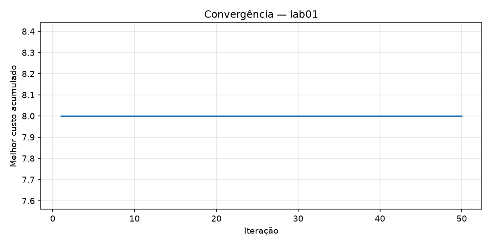
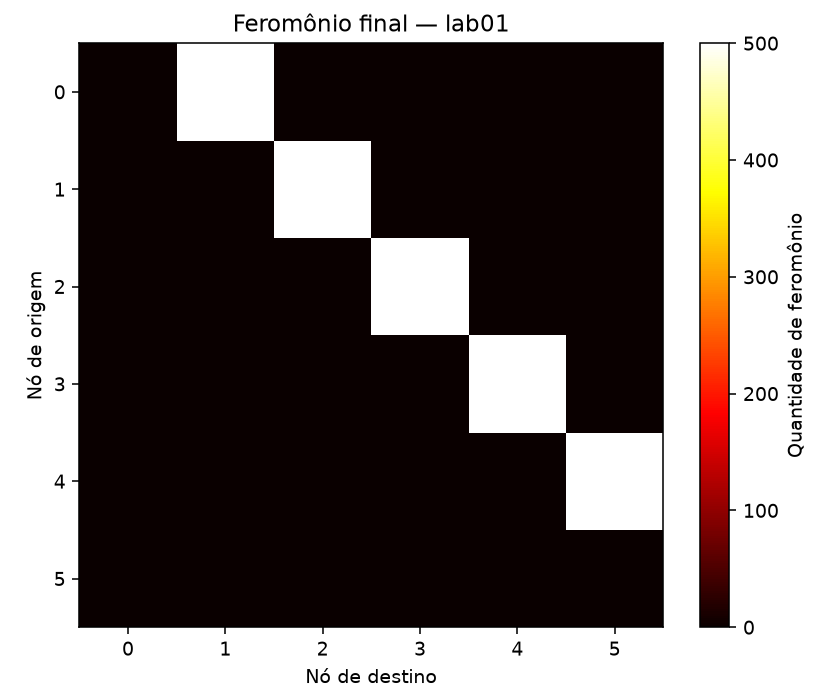
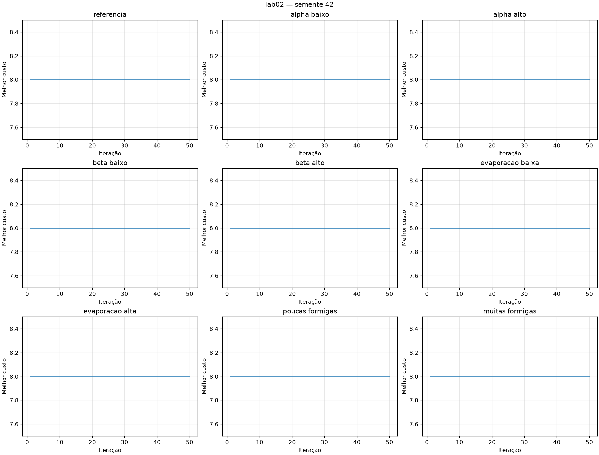
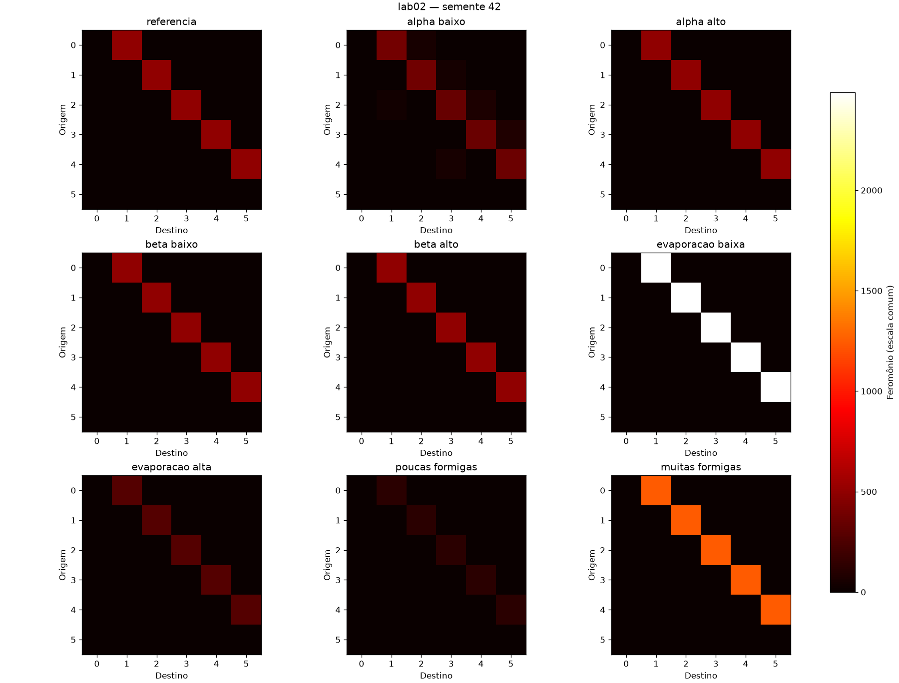
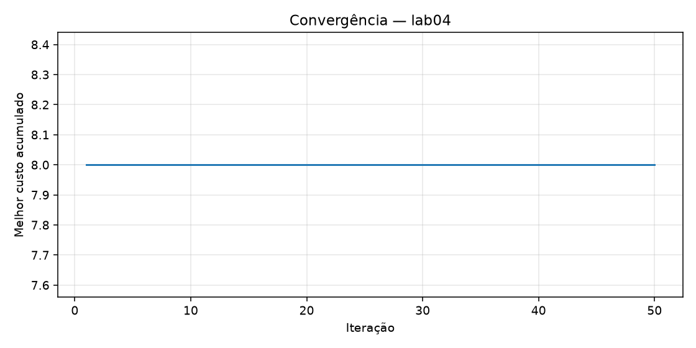
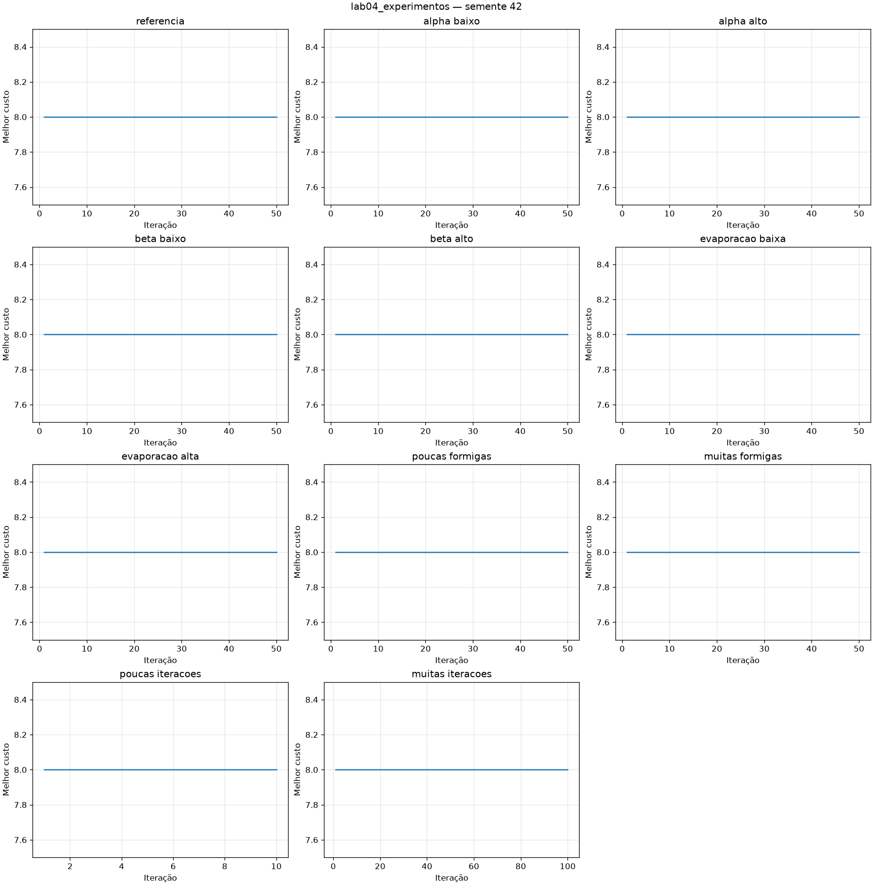
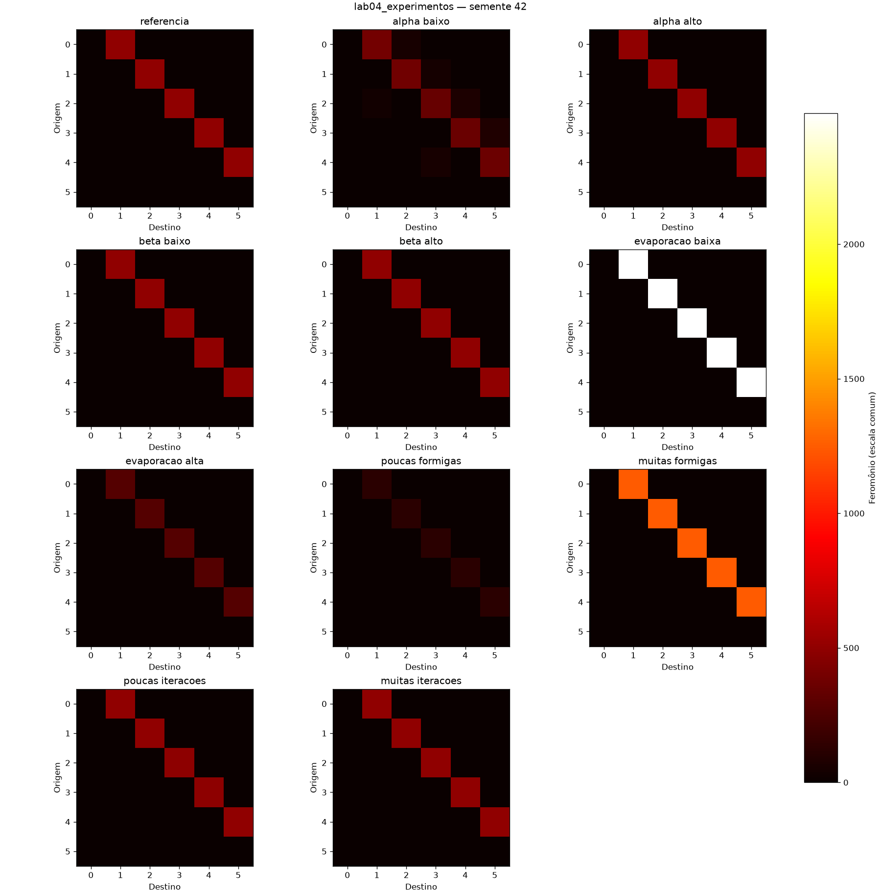

# Resultados — AULA 06: ACO

## Laboratório 01

### Outputs da execução

Ambiente: Python 3.13.13, NumPy 2.5.1 e Matplotlib 3.11.1. A aleatoriedade utiliza apenas `random`; o NumPy é usado para operações determinísticas com matrizes. As demonstrações e a colônia usam sequências reiniciadas separadamente com semente 42.

```text
NUM_FORMIGAS: 20
NUM_ITERACOES: 50
ALPHA: 1.0
BETA: 2.0
TAXA_EVAPORACAO: 0.5
Q: 100
Semente: 42
Melhor rota: [0, 1, 2, 3, 4, 5]
Melhor custo: 8.0
Rotas distintas completas: 9
Rotas incompletas: 0
```

Matriz inicial de feromônio:

```text
[[1. 1. 1. 0. 0. 0.]
 [1. 1. 1. 1. 0. 0.]
 [1. 1. 1. 1. 1. 0.]
 [0. 1. 1. 1. 1. 1.]
 [0. 0. 1. 1. 1. 1.]
 [0. 0. 0. 1. 1. 1.]]
```

Vizinhos do nó 0: `[1, 2]`. Vizinhos do nó 2: `[0, 1, 3, 4]`.

| Formiga demonstrativa | Rota | Custo |
|---|---|---:|
| 1 | [0, 1, 2, 3, 4, 5] | 8.0 |
| 2 | [0, 1, 2, 3, 4, 5] | 8.0 |
| 3 | [0, 1, 2, 3, 4, 5] | 8.0 |
| 4 | [0, 1, 2, 3, 4, 5] | 8.0 |
| 5 | [0, 2, 1, 3, 4, 5] | 13.0 |

Matriz final de feromônio:

```text
[[8.882e-16 5.000e+02 1.791e-13 0.000e+00 0.000e+00 0.000e+00]
 [8.882e-16 8.882e-16 5.000e+02 5.867e-14 0.000e+00 0.000e+00]
 [8.882e-16 4.091e-14 8.882e-16 5.000e+02 6.043e-12 0.000e+00]
 [0.000e+00 8.882e-16 8.882e-16 8.882e-16 5.000e+02 7.959e-13]
 [0.000e+00 0.000e+00 8.882e-16 9.240e-14 8.882e-16 5.000e+02]
 [0.000e+00 0.000e+00 0.000e+00 8.882e-16 8.882e-16 8.882e-16]]
```





O melhor custo já era 8 na primeira iteração e permaneceu em 8 nas 50 iterações. A curva horizontal indica que a melhor solução foi encontrada cedo; não houve redução gradual do melhor custo nesta execução. O feromônio final ficou concentrado nas conexões 0→1, 1→2, 2→3, 3→4 e 4→5, próximas de 500 unidades cada.

Foi mantida a convenção do enunciado: depósito apenas no sentido percorrido, embora os custos sejam simétricos. A diagonal começa com 1 e evapora, mas nunca participa da escolha, pois o próprio nó é excluído. Conexões inexistentes permanecem com feromônio zero. Valores muito pequenos nas outras posições são resíduos da evaporação.

### Questão 1 — Por que utilizar várias formigas?

Várias formigas permitem experimentar alternativas na mesma iteração e reunir informações sobre diferentes rotas. Uma única formiga poderia escolher um caminho ruim e fornecer pouca informação à busca. A escolha probabilística mantém a possibilidade de explorar alternativas, enquanto a colônia aproveita as experiências coletivas. Nesta execução, a colônia percorreu 9 rotas completas distintas ao longo das iterações; nem todas as formigas precisam fazer o mesmo caminho.

### Questão 2 — Por que uma rota de menor custo recebe mais feromônio?

O depósito é Q/custo. Com Q = 100, uma rota de custo 8 recebe 12,5 unidades por conexão percorrida, enquanto uma rota de custo 13 recebe aproximadamente 7,69. Esse reforço aumenta a atratividade das conexões usadas por boas rotas e, em relação às alternativas, sua probabilidade de escolha pelas próximas formigas. Todas as rotas completas recebem depósito nesta implementação, mas as de menor custo recebem mais por formiga.

### Questão 3 — O que aconteceria sem evaporação?

O feromônio acumulado nas primeiras rotas nunca diminuiria. Uma escolha inicial pouco eficiente poderia continuar muito influente, reduzir a diversidade e favorecer estagnação. A evaporação diminui o peso de experiências antigas e permite que descobertas recentes ganhem importância. Ela ajuda a controlar esse efeito, mas não garante que o algoritmo encontre o ótimo em qualquer problema.

## Laboratório 02

### Outputs dos cenários — semente 42

F = número de formigas; I = número de iterações; ρ = taxa de evaporação. Q = 100 em todos os cenários. Cada execução reinicia o feromônio e o sorteio.

| Cenário | F | I | ALPHA | BETA | ρ | Melhor rota | Custo | Rotas distintas | Maior feromônio |
|---|---:|---:|---:|---:|---:|---|---:|---:|---:|
| referencia | 20 | 50 | 1.0 | 2.0 | 0.5 | [0, 1, 2, 3, 4, 5] | 8.0 | 9 | 500.000 |
| alpha_baixo | 20 | 50 | 0.1 | 2.0 | 0.5 | [0, 1, 2, 3, 4, 5] | 8.0 | 11 | 392.522 |
| alpha_alto | 20 | 50 | 5.0 | 2.0 | 0.5 | [0, 1, 2, 3, 4, 5] | 8.0 | 6 | 500.000 |
| beta_baixo | 20 | 50 | 1.0 | 0.5 | 0.5 | [0, 1, 2, 3, 4, 5] | 8.0 | 12 | 500.000 |
| beta_alto | 20 | 50 | 1.0 | 5.0 | 0.5 | [0, 1, 2, 3, 4, 5] | 8.0 | 2 | 500.000 |
| evaporacao_baixa | 20 | 50 | 1.0 | 2.0 | 0.1 | [0, 1, 2, 3, 4, 5] | 8.0 | 9 | 2486.510 |
| evaporacao_alta | 20 | 50 | 1.0 | 2.0 | 0.9 | [0, 1, 2, 3, 4, 5] | 8.0 | 7 | 277.778 |
| poucas_formigas | 5 | 50 | 1.0 | 2.0 | 0.5 | [0, 1, 2, 3, 4, 5] | 8.0 | 3 | 125.000 |
| muitas_formigas | 50 | 50 | 1.0 | 2.0 | 0.5 | [0, 1, 2, 3, 4, 5] | 8.0 | 8 | 1250.000 |





Os mapas usam a mesma escala de cores dentro de cada painel. A cor indica quantidade absoluta, que também depende do número de depósitos e da evaporação; maior brilho não significa, por si só, melhor solução.

### Outputs das repetições — sementes 0 a 9

O desvio padrão abaixo é populacional (`ddof=0`) para as dez execuções. “Primeiro ótimo” é a primeira iteração cujo melhor custo acumulado é 8.

| Cenário | Média do custo | Desvio padrão | Mín.–máx. | Ótimo | Média do primeiro ótimo | Média de rotas distintas |
|---|---:|---:|---|---:|---:|---:|
| referencia | 8.000 | 0.000 | 8.0–8.0 | 10/10 | 1.00 | 6.70 |
| alpha_baixo | 8.000 | 0.000 | 8.0–8.0 | 10/10 | 1.00 | 12.10 |
| alpha_alto | 8.000 | 0.000 | 8.0–8.0 | 10/10 | 1.00 | 5.70 |
| beta_baixo | 8.000 | 0.000 | 8.0–8.0 | 10/10 | 1.10 | 11.90 |
| beta_alto | 8.000 | 0.000 | 8.0–8.0 | 10/10 | 1.00 | 2.90 |
| evaporacao_baixa | 8.000 | 0.000 | 8.0–8.0 | 10/10 | 1.00 | 7.20 |
| evaporacao_alta | 8.000 | 0.000 | 8.0–8.0 | 10/10 | 1.00 | 6.40 |
| poucas_formigas | 8.000 | 0.000 | 8.0–8.0 | 10/10 | 1.00 | 3.60 |
| muitas_formigas | 8.000 | 0.000 | 8.0–8.0 | 10/10 | 1.00 | 8.20 |

### Matrizes finais e históricos — semente 42

Linhas representam origem e colunas representam destino, na ordem 0 a 5. Matrizes exibidas com três casas de precisão.

#### referencia

```text
[[8.882e-16 5.000e+02 1.791e-13 0.000e+00 0.000e+00 0.000e+00]
 [8.882e-16 8.882e-16 5.000e+02 5.867e-14 0.000e+00 0.000e+00]
 [8.882e-16 4.091e-14 8.882e-16 5.000e+02 6.043e-12 0.000e+00]
 [0.000e+00 8.882e-16 8.882e-16 8.882e-16 5.000e+02 7.959e-13]
 [0.000e+00 0.000e+00 8.882e-16 9.240e-14 8.882e-16 5.000e+02]
 [0.000e+00 0.000e+00 0.000e+00 8.882e-16 8.882e-16 8.882e-16]]
```

Histórico do melhor custo: `[8.0, 8.0, 8.0, 8.0, 8.0, 8.0, 8.0, 8.0, 8.0, 8.0, 8.0, 8.0, 8.0, 8.0, 8.0, 8.0, 8.0, 8.0, 8.0, 8.0, 8.0, 8.0, 8.0, 8.0, 8.0, 8.0, 8.0, 8.0, 8.0, 8.0, 8.0, 8.0, 8.0, 8.0, 8.0, 8.0, 8.0, 8.0, 8.0, 8.0, 8.0, 8.0, 8.0, 8.0, 8.0, 8.0, 8.0, 8.0, 8.0, 8.0]`.

#### alpha_baixo

```text
[[8.882e-16 3.925e+02 5.809e+01 0.000e+00 0.000e+00 0.000e+00]
 [8.882e-16 8.882e-16 3.869e+02 3.887e+01 0.000e+00 0.000e+00]
 [8.882e-16 3.327e+01 8.882e-16 3.409e+02 7.080e+01 0.000e+00]
 [0.000e+00 8.882e-16 8.882e-16 8.882e-16 3.539e+02 8.155e+01]
 [0.000e+00 0.000e+00 8.882e-16 5.560e+01 8.882e-16 3.691e+02]
 [0.000e+00 0.000e+00 0.000e+00 8.882e-16 8.882e-16 8.882e-16]]
```

Histórico do melhor custo: `[8.0, 8.0, 8.0, 8.0, 8.0, 8.0, 8.0, 8.0, 8.0, 8.0, 8.0, 8.0, 8.0, 8.0, 8.0, 8.0, 8.0, 8.0, 8.0, 8.0, 8.0, 8.0, 8.0, 8.0, 8.0, 8.0, 8.0, 8.0, 8.0, 8.0, 8.0, 8.0, 8.0, 8.0, 8.0, 8.0, 8.0, 8.0, 8.0, 8.0, 8.0, 8.0, 8.0, 8.0, 8.0, 8.0, 8.0, 8.0, 8.0, 8.0]`.

#### alpha_alto

```text
[[8.882e-16 5.000e+02 4.091e-14 0.000e+00 0.000e+00 0.000e+00]
 [8.882e-16 8.882e-16 5.000e+02 5.867e-14 0.000e+00 0.000e+00]
 [8.882e-16 4.091e-14 8.882e-16 5.000e+02 3.319e-14 0.000e+00]
 [0.000e+00 8.882e-16 8.882e-16 8.882e-16 5.000e+02 6.561e-14]
 [0.000e+00 0.000e+00 8.882e-16 3.319e-14 8.882e-16 5.000e+02]
 [0.000e+00 0.000e+00 0.000e+00 8.882e-16 8.882e-16 8.882e-16]]
```

Histórico do melhor custo: `[8.0, 8.0, 8.0, 8.0, 8.0, 8.0, 8.0, 8.0, 8.0, 8.0, 8.0, 8.0, 8.0, 8.0, 8.0, 8.0, 8.0, 8.0, 8.0, 8.0, 8.0, 8.0, 8.0, 8.0, 8.0, 8.0, 8.0, 8.0, 8.0, 8.0, 8.0, 8.0, 8.0, 8.0, 8.0, 8.0, 8.0, 8.0, 8.0, 8.0, 8.0, 8.0, 8.0, 8.0, 8.0, 8.0, 8.0, 8.0, 8.0, 8.0]`.

#### beta_baixo

```text
[[8.882e-16 5.000e+02 4.045e-09 0.000e+00 0.000e+00 0.000e+00]
 [8.882e-16 8.882e-16 5.000e+02 1.909e-11 0.000e+00 0.000e+00]
 [8.882e-16 2.156e-13 8.882e-16 5.000e+02 3.690e-10 0.000e+00]
 [0.000e+00 8.882e-16 1.358e-14 8.882e-16 5.000e+02 9.150e-13]
 [0.000e+00 0.000e+00 8.882e-16 1.569e-14 8.882e-16 5.000e+02]
 [0.000e+00 0.000e+00 0.000e+00 8.882e-16 8.882e-16 8.882e-16]]
```

Histórico do melhor custo: `[8.0, 8.0, 8.0, 8.0, 8.0, 8.0, 8.0, 8.0, 8.0, 8.0, 8.0, 8.0, 8.0, 8.0, 8.0, 8.0, 8.0, 8.0, 8.0, 8.0, 8.0, 8.0, 8.0, 8.0, 8.0, 8.0, 8.0, 8.0, 8.0, 8.0, 8.0, 8.0, 8.0, 8.0, 8.0, 8.0, 8.0, 8.0, 8.0, 8.0, 8.0, 8.0, 8.0, 8.0, 8.0, 8.0, 8.0, 8.0, 8.0, 8.0]`.

#### beta_alto

```text
[[8.882e-16 5.000e+02 1.455e-14 0.000e+00 0.000e+00 0.000e+00]
 [8.882e-16 8.882e-16 5.000e+02 1.455e-14 0.000e+00 0.000e+00]
 [8.882e-16 1.455e-14 8.882e-16 5.000e+02 8.882e-16 0.000e+00]
 [0.000e+00 8.882e-16 8.882e-16 8.882e-16 5.000e+02 8.882e-16]
 [0.000e+00 0.000e+00 8.882e-16 8.882e-16 8.882e-16 5.000e+02]
 [0.000e+00 0.000e+00 0.000e+00 8.882e-16 8.882e-16 8.882e-16]]
```

Histórico do melhor custo: `[8.0, 8.0, 8.0, 8.0, 8.0, 8.0, 8.0, 8.0, 8.0, 8.0, 8.0, 8.0, 8.0, 8.0, 8.0, 8.0, 8.0, 8.0, 8.0, 8.0, 8.0, 8.0, 8.0, 8.0, 8.0, 8.0, 8.0, 8.0, 8.0, 8.0, 8.0, 8.0, 8.0, 8.0, 8.0, 8.0, 8.0, 8.0, 8.0, 8.0, 8.0, 8.0, 8.0, 8.0, 8.0, 8.0, 8.0, 8.0, 8.0, 8.0]`.

#### evaporacao_baixa

```text
[[5.154e-03 2.485e+03 1.526e+00 0.000e+00 0.000e+00 0.000e+00]
 [5.154e-03 5.154e-03 2.485e+03 1.914e-01 0.000e+00 0.000e+00]
 [5.154e-03 1.342e-01 5.154e-03 2.484e+03 2.218e+00 0.000e+00]
 [0.000e+00 5.154e-03 5.154e-03 5.154e-03 2.484e+03 2.727e-01]
 [0.000e+00 0.000e+00 5.154e-03 1.682e-01 5.154e-03 2.487e+03]
 [0.000e+00 0.000e+00 0.000e+00 5.154e-03 5.154e-03 5.154e-03]]
```

Histórico do melhor custo: `[8.0, 8.0, 8.0, 8.0, 8.0, 8.0, 8.0, 8.0, 8.0, 8.0, 8.0, 8.0, 8.0, 8.0, 8.0, 8.0, 8.0, 8.0, 8.0, 8.0, 8.0, 8.0, 8.0, 8.0, 8.0, 8.0, 8.0, 8.0, 8.0, 8.0, 8.0, 8.0, 8.0, 8.0, 8.0, 8.0, 8.0, 8.0, 8.0, 8.0, 8.0, 8.0, 8.0, 8.0, 8.0, 8.0, 8.0, 8.0, 8.0, 8.0]`.

#### evaporacao_alta

```text
[[1.000e-50 2.778e+02 2.263e-48 0.000e+00 0.000e+00 0.000e+00]
 [1.000e-50 1.000e-50 2.778e+02 3.263e-48 0.000e+00 0.000e+00]
 [1.000e-50 2.263e-48 1.000e-50 2.778e+02 1.268e-46 0.000e+00]
 [0.000e+00 1.000e-50 1.000e-50 1.000e-50 2.778e+02 1.476e-47]
 [0.000e+00 0.000e+00 1.000e-50 1.828e-48 1.000e-50 2.778e+02]
 [0.000e+00 0.000e+00 0.000e+00 1.000e-50 1.000e-50 1.000e-50]]
```

Histórico do melhor custo: `[8.0, 8.0, 8.0, 8.0, 8.0, 8.0, 8.0, 8.0, 8.0, 8.0, 8.0, 8.0, 8.0, 8.0, 8.0, 8.0, 8.0, 8.0, 8.0, 8.0, 8.0, 8.0, 8.0, 8.0, 8.0, 8.0, 8.0, 8.0, 8.0, 8.0, 8.0, 8.0, 8.0, 8.0, 8.0, 8.0, 8.0, 8.0, 8.0, 8.0, 8.0, 8.0, 8.0, 8.0, 8.0, 8.0, 8.0, 8.0, 8.0, 8.0]`.

#### poucas_formigas

```text
[[8.882e-16 1.250e+02 9.350e-14 0.000e+00 0.000e+00 0.000e+00]
 [8.882e-16 8.882e-16 1.250e+02 1.455e-14 0.000e+00 0.000e+00]
 [8.882e-16 1.455e-14 8.882e-16 1.250e+02 8.882e-16 0.000e+00]
 [0.000e+00 8.882e-16 8.882e-16 8.882e-16 1.250e+02 8.882e-16]
 [0.000e+00 0.000e+00 8.882e-16 8.882e-16 8.882e-16 1.250e+02]
 [0.000e+00 0.000e+00 0.000e+00 8.882e-16 8.882e-16 8.882e-16]]
```

Histórico do melhor custo: `[8.0, 8.0, 8.0, 8.0, 8.0, 8.0, 8.0, 8.0, 8.0, 8.0, 8.0, 8.0, 8.0, 8.0, 8.0, 8.0, 8.0, 8.0, 8.0, 8.0, 8.0, 8.0, 8.0, 8.0, 8.0, 8.0, 8.0, 8.0, 8.0, 8.0, 8.0, 8.0, 8.0, 8.0, 8.0, 8.0, 8.0, 8.0, 8.0, 8.0, 8.0, 8.0, 8.0, 8.0, 8.0, 8.0, 8.0, 8.0, 8.0, 8.0]`.

#### muitas_formigas

```text
[[8.882e-16 1.250e+03 3.476e-13 0.000e+00 0.000e+00 0.000e+00]
 [8.882e-16 8.882e-16 1.250e+03 2.035e-13 0.000e+00 0.000e+00]
 [8.882e-16 1.502e-13 8.882e-16 1.250e+03 4.775e-12 0.000e+00]
 [0.000e+00 8.882e-16 8.882e-16 8.882e-16 1.250e+03 3.096e-13]
 [0.000e+00 0.000e+00 8.882e-16 1.785e-13 8.882e-16 1.250e+03]
 [0.000e+00 0.000e+00 0.000e+00 8.882e-16 8.882e-16 8.882e-16]]
```

Histórico do melhor custo: `[8.0, 8.0, 8.0, 8.0, 8.0, 8.0, 8.0, 8.0, 8.0, 8.0, 8.0, 8.0, 8.0, 8.0, 8.0, 8.0, 8.0, 8.0, 8.0, 8.0, 8.0, 8.0, 8.0, 8.0, 8.0, 8.0, 8.0, 8.0, 8.0, 8.0, 8.0, 8.0, 8.0, 8.0, 8.0, 8.0, 8.0, 8.0, 8.0, 8.0, 8.0, 8.0, 8.0, 8.0, 8.0, 8.0, 8.0, 8.0, 8.0, 8.0]`.

### Experimento 1 — Influência do ALPHA

Aumentar ALPHA aumenta a influência relativa das diferenças de feromônio: a razão entre as atratividades inclui (τ₁/τ₂)^ALPHA. Quando os feromônios são iguais, mudar ALPHA não diferencia as escolhas por esse fator. Na semente 42, ALPHA = 0,1 produziu 11 rotas distintas e ALPHA = 5 produziu 6; a referência produziu 9. O ALPHA baixo manteve feromônio mais distribuído, enquanto o alto favoreceu a concentração. Todos alcançaram custo 8; o experimento não mostrou vantagem no custo final para ALPHA alto.

### Experimento 2 — Influência do BETA

BETA determina quanto o inverso do custo da próxima conexão influencia a escolha. Com BETA alto, conexões locais mais baratas tornam-se relativamente mais atraentes; com BETA baixo, essa preferência enfraquece. Na semente 42, BETA = 0,5 explorou 12 rotas distintas e BETA = 5 explorou 2, ambos com custo final 8. Dar preferência a uma conexão barata não garante a menor soma até o destino em um grafo qualquer.

### Experimento 3 — Evaporação

Com taxa 0,1, permanece 90% do feromônio anterior em cada iteração; com 0,9, permanece apenas 10%. Esquecer rapidamente torna o algoritmo mais dependente dos depósitos recentes e reduz a persistência da memória. Na semente 42, o maior feromônio final foi aproximadamente 2.486,510 com taxa 0,1 e 277,778 com taxa 0,9. Houve 9 e 7 rotas distintas, respectivamente. Ambos obtiveram custo 8. Portanto, a evaporação maior não produziu maior diversidade nesta execução; evaporação uniforme preserva as proporções naquele instante, mas altera o peso da memória antiga frente aos novos depósitos.

### Experimento 4 — Número de formigas

Com 5 formigas e 50 iterações houve 250 tentativas de construção; com 50 formigas, 2.500. Na semente 42, foram exploradas 3 e 8 rotas distintas, respectivamente, com custo final 8 nos dois casos. Mais formigas aumentam as oportunidades de exploração por iteração e o trabalho computacional, sem garantir uma rota melhor. O feromônio máximo também aumentou de 125 para 1.250 devido ao maior número de depósitos. Não foi medido tempo de execução para afirmar uma razão de velocidade.

Nas dez repetições de cada cenário, todos obtiveram custo final 8, média 8 e desvio padrão zero. Essa igualdade neste grafo pequeno não demonstra equivalência geral dos parâmetros; as diferenças de diversidade e memória permanecem visíveis.

## Laboratório 03

### Desafio 1 — Atratividade

```python
def calcular_atratividade(no_atual, proximo):
    fer = feromonio[no_atual][proximo]
    custo = CUSTOS[no_atual][proximo]
    atratividade = fer ** ALPHA * (1 / custo) ** BETA
    return atratividade
```

### Desafio 2 — Evaporação

```python
def evaporar_feromonio():
    global feromonio
    feromonio *= (1 - TAXA_EVAPORACAO)
    feromonio[CUSTOS == np.inf] = 0
```

### Desafio 3 — Depósito

```python
def depositar_feromonio(rota, custo):
    deposito = Q / custo
    for i in range(len(rota) - 1):
        origem, destino = rota[i], rota[i + 1]
        feromonio[origem][destino] += deposito
```

### Desafio 4 — Construção da rota

```python
def construir_rota():
    rota = [ORIGEM]
    atual = ORIGEM
    while atual != DESTINO:
        vizinhos = obter_vizinhos(atual)
        candidatos = [no for no in vizinhos if no not in rota]
        if not candidatos:
            return None
        atratividades = [calcular_atratividade(atual, no) for no in candidatos]
        soma = sum(atratividades)
        probabilidades = [valor / soma for valor in atratividades] if soma > 0 else None
        proximo = random.choices(candidatos, weights=probabilidades, k=1)[0]
        rota.append(proximo)
        atual = proximo
    return rota
```

### Cálculo de custo utilizado na execução

```python
def calcular_custo(rota):
    return float(sum(CUSTOS[a, b] for a, b in zip(rota, rota[1:])))
```

### Outputs da execução

```text
NUM_FORMIGAS: 20
NUM_ITERACOES: 50
ALPHA: 1.0
BETA: 2.0
TAXA_EVAPORACAO: 0.5
Q: 100
Semente: 42
Melhor rota: [0, 1, 2, 3, 4, 5]
Melhor custo: 8.0
Rotas distintas completas: 9
Rotas incompletas: 0
```


O melhor custo permaneceu em 8 desde a primeira iteração. 

### Questão 1 — Por que utilizar 1/custo?

O objetivo é minimizar o custo. O inverso transforma um custo menor em atratividade maior, mantidos os demais fatores. Com feromônio 1 e BETA = 2, custos 2 e 4 geram atratividades 0,25 e 0,0625, respectivamente. Usar o custo diretamente com expoente positivo favoreceria conexões caras.

### Questão 2 — O que ocorre quando há mais feromônio?

Para ALPHA positivo, aumentar o feromônio de uma conexão aumenta sua atratividade. Se as outras opções permanecerem iguais, sua probabilidade normalizada de escolha cresce. Isso reforça a experiência acumulada pelas formigas, sem tornar a escolha obrigatória.

### Questão 3 — Por que impedir visitas repetidas?

O controle de visitados evita ciclos e deslocamentos desnecessários. Como os custos das conexões são positivos, um ciclo acrescentaria custo sem ajudar a minimizar a rota. A restrição também limita a construção a no máximo seis nós neste grafo. Se não houver candidato antes de chegar ao destino, a formiga retorna `None` e sua rota é descartada.

## Laboratório 04

### Output da implementação do zero

```text
NUM_FORMIGAS: 20
NUM_ITERACOES: 50
ALPHA: 1.0
BETA: 2.0
TAXA_EVAPORACAO: 0.5
Q: 100
Semente: 42
Melhor rota: [0, 1, 2, 3, 4, 5]
Melhor custo: 8.0
Rotas distintas completas: 9
Rotas incompletas: 0
```




### Atendimento aos 12 requisitos

| Requisito | Resultado da implementação |
|---|---|
| 1. Matriz de custos | Matriz 6×6 do enunciado, com infinito nas conexões inexistentes |
| 2. Matriz de feromônio | Matriz inicializada em 1 nas posições finitas e em 0 nas demais |
| 3. Várias formigas | 20 tentativas por iteração na execução inicial |
| 4. Construção de rotas | Sorteio ponderado de vizinhos, da origem 0 ao destino 5 |
| 5. Sem revisitar nós | Conjunto `visitados` excluído das opções |
| 6. Custo | Soma das conexões consecutivas da rota completa |
| 7. Reforço | Depósito Q/custo, maior para rotas de menor custo |
| 8. Evaporação | Multiplicação da matriz por 1 − taxa antes do depósito |
| 9. Iterações | 50 ciclos na execução inicial |
| 10. Melhor rota | [0, 1, 2, 3, 4, 5] |
| 11. Melhor custo | 8,0 |
| 12. Evolução | Gráfico com um valor de melhor custo acumulado por iteração |

### Outputs dos cenários — semente 42

F = número de formigas; I = número de iterações; ρ = taxa de evaporação. Q = 100 em todos os cenários. Cada execução reinicia o feromônio e o sorteio.

| Cenário | F | I | ALPHA | BETA | ρ | Melhor rota | Custo | Rotas distintas | Maior feromônio |
|---|---:|---:|---:|---:|---:|---|---:|---:|---:|
| referencia | 20 | 50 | 1.0 | 2.0 | 0.5 | [0, 1, 2, 3, 4, 5] | 8.0 | 9 | 500.000 |
| alpha_baixo | 20 | 50 | 0.1 | 2.0 | 0.5 | [0, 1, 2, 3, 4, 5] | 8.0 | 11 | 392.522 |
| alpha_alto | 20 | 50 | 5.0 | 2.0 | 0.5 | [0, 1, 2, 3, 4, 5] | 8.0 | 6 | 500.000 |
| beta_baixo | 20 | 50 | 1.0 | 0.5 | 0.5 | [0, 1, 2, 3, 4, 5] | 8.0 | 12 | 500.000 |
| beta_alto | 20 | 50 | 1.0 | 5.0 | 0.5 | [0, 1, 2, 3, 4, 5] | 8.0 | 2 | 500.000 |
| evaporacao_baixa | 20 | 50 | 1.0 | 2.0 | 0.1 | [0, 1, 2, 3, 4, 5] | 8.0 | 9 | 2486.510 |
| evaporacao_alta | 20 | 50 | 1.0 | 2.0 | 0.9 | [0, 1, 2, 3, 4, 5] | 8.0 | 7 | 277.778 |
| poucas_formigas | 5 | 50 | 1.0 | 2.0 | 0.5 | [0, 1, 2, 3, 4, 5] | 8.0 | 3 | 125.000 |
| muitas_formigas | 50 | 50 | 1.0 | 2.0 | 0.5 | [0, 1, 2, 3, 4, 5] | 8.0 | 8 | 1250.000 |
| poucas_iteracoes | 20 | 10 | 1.0 | 2.0 | 0.5 | [0, 1, 2, 3, 4, 5] | 8.0 | 9 | 499.131 |
| muitas_iteracoes | 20 | 100 | 1.0 | 2.0 | 0.5 | [0, 1, 2, 3, 4, 5] | 8.0 | 9 | 500.000 |





Os mapas usam a mesma escala de cores dentro de cada painel. A cor indica quantidade absoluta, que também depende do número de depósitos e da evaporação; maior brilho não significa, por si só, melhor solução.

### Outputs das repetições — sementes 0 a 9

O desvio padrão abaixo é populacional (`ddof=0`) para as dez execuções. “Primeiro ótimo” é a primeira iteração cujo melhor custo acumulado é 8.

| Cenário | Média do custo | Desvio padrão | Mín.–máx. | Ótimo | Média do primeiro ótimo | Média de rotas distintas |
|---|---:|---:|---|---:|---:|---:|
| referencia | 8.000 | 0.000 | 8.0–8.0 | 10/10 | 1.00 | 6.70 |
| alpha_baixo | 8.000 | 0.000 | 8.0–8.0 | 10/10 | 1.00 | 12.10 |
| alpha_alto | 8.000 | 0.000 | 8.0–8.0 | 10/10 | 1.00 | 5.70 |
| beta_baixo | 8.000 | 0.000 | 8.0–8.0 | 10/10 | 1.10 | 11.90 |
| beta_alto | 8.000 | 0.000 | 8.0–8.0 | 10/10 | 1.00 | 2.90 |
| evaporacao_baixa | 8.000 | 0.000 | 8.0–8.0 | 10/10 | 1.00 | 7.20 |
| evaporacao_alta | 8.000 | 0.000 | 8.0–8.0 | 10/10 | 1.00 | 6.40 |
| poucas_formigas | 8.000 | 0.000 | 8.0–8.0 | 10/10 | 1.00 | 3.60 |
| muitas_formigas | 8.000 | 0.000 | 8.0–8.0 | 10/10 | 1.00 | 8.20 |
| poucas_iteracoes | 8.000 | 0.000 | 8.0–8.0 | 10/10 | 1.00 | 6.70 |
| muitas_iteracoes | 8.000 | 0.000 | 8.0–8.0 | 10/10 | 1.00 | 6.70 |

### Matrizes finais e históricos — semente 42

Linhas representam origem e colunas representam destino, na ordem 0 a 5. Matrizes exibidas com três casas de precisão.

#### referencia

```text
[[8.882e-16 5.000e+02 1.791e-13 0.000e+00 0.000e+00 0.000e+00]
 [8.882e-16 8.882e-16 5.000e+02 5.867e-14 0.000e+00 0.000e+00]
 [8.882e-16 4.091e-14 8.882e-16 5.000e+02 6.043e-12 0.000e+00]
 [0.000e+00 8.882e-16 8.882e-16 8.882e-16 5.000e+02 7.959e-13]
 [0.000e+00 0.000e+00 8.882e-16 9.240e-14 8.882e-16 5.000e+02]
 [0.000e+00 0.000e+00 0.000e+00 8.882e-16 8.882e-16 8.882e-16]]
```

Histórico do melhor custo: `[8.0, 8.0, 8.0, 8.0, 8.0, 8.0, 8.0, 8.0, 8.0, 8.0, 8.0, 8.0, 8.0, 8.0, 8.0, 8.0, 8.0, 8.0, 8.0, 8.0, 8.0, 8.0, 8.0, 8.0, 8.0, 8.0, 8.0, 8.0, 8.0, 8.0, 8.0, 8.0, 8.0, 8.0, 8.0, 8.0, 8.0, 8.0, 8.0, 8.0, 8.0, 8.0, 8.0, 8.0, 8.0, 8.0, 8.0, 8.0, 8.0, 8.0]`.

#### alpha_baixo

```text
[[8.882e-16 3.925e+02 5.809e+01 0.000e+00 0.000e+00 0.000e+00]
 [8.882e-16 8.882e-16 3.869e+02 3.887e+01 0.000e+00 0.000e+00]
 [8.882e-16 3.327e+01 8.882e-16 3.409e+02 7.080e+01 0.000e+00]
 [0.000e+00 8.882e-16 8.882e-16 8.882e-16 3.539e+02 8.155e+01]
 [0.000e+00 0.000e+00 8.882e-16 5.560e+01 8.882e-16 3.691e+02]
 [0.000e+00 0.000e+00 0.000e+00 8.882e-16 8.882e-16 8.882e-16]]
```

Histórico do melhor custo: `[8.0, 8.0, 8.0, 8.0, 8.0, 8.0, 8.0, 8.0, 8.0, 8.0, 8.0, 8.0, 8.0, 8.0, 8.0, 8.0, 8.0, 8.0, 8.0, 8.0, 8.0, 8.0, 8.0, 8.0, 8.0, 8.0, 8.0, 8.0, 8.0, 8.0, 8.0, 8.0, 8.0, 8.0, 8.0, 8.0, 8.0, 8.0, 8.0, 8.0, 8.0, 8.0, 8.0, 8.0, 8.0, 8.0, 8.0, 8.0, 8.0, 8.0]`.

#### alpha_alto

```text
[[8.882e-16 5.000e+02 4.091e-14 0.000e+00 0.000e+00 0.000e+00]
 [8.882e-16 8.882e-16 5.000e+02 5.867e-14 0.000e+00 0.000e+00]
 [8.882e-16 4.091e-14 8.882e-16 5.000e+02 3.319e-14 0.000e+00]
 [0.000e+00 8.882e-16 8.882e-16 8.882e-16 5.000e+02 6.561e-14]
 [0.000e+00 0.000e+00 8.882e-16 3.319e-14 8.882e-16 5.000e+02]
 [0.000e+00 0.000e+00 0.000e+00 8.882e-16 8.882e-16 8.882e-16]]
```

Histórico do melhor custo: `[8.0, 8.0, 8.0, 8.0, 8.0, 8.0, 8.0, 8.0, 8.0, 8.0, 8.0, 8.0, 8.0, 8.0, 8.0, 8.0, 8.0, 8.0, 8.0, 8.0, 8.0, 8.0, 8.0, 8.0, 8.0, 8.0, 8.0, 8.0, 8.0, 8.0, 8.0, 8.0, 8.0, 8.0, 8.0, 8.0, 8.0, 8.0, 8.0, 8.0, 8.0, 8.0, 8.0, 8.0, 8.0, 8.0, 8.0, 8.0, 8.0, 8.0]`.

#### beta_baixo

```text
[[8.882e-16 5.000e+02 4.045e-09 0.000e+00 0.000e+00 0.000e+00]
 [8.882e-16 8.882e-16 5.000e+02 1.909e-11 0.000e+00 0.000e+00]
 [8.882e-16 2.156e-13 8.882e-16 5.000e+02 3.690e-10 0.000e+00]
 [0.000e+00 8.882e-16 1.358e-14 8.882e-16 5.000e+02 9.150e-13]
 [0.000e+00 0.000e+00 8.882e-16 1.569e-14 8.882e-16 5.000e+02]
 [0.000e+00 0.000e+00 0.000e+00 8.882e-16 8.882e-16 8.882e-16]]
```

Histórico do melhor custo: `[8.0, 8.0, 8.0, 8.0, 8.0, 8.0, 8.0, 8.0, 8.0, 8.0, 8.0, 8.0, 8.0, 8.0, 8.0, 8.0, 8.0, 8.0, 8.0, 8.0, 8.0, 8.0, 8.0, 8.0, 8.0, 8.0, 8.0, 8.0, 8.0, 8.0, 8.0, 8.0, 8.0, 8.0, 8.0, 8.0, 8.0, 8.0, 8.0, 8.0, 8.0, 8.0, 8.0, 8.0, 8.0, 8.0, 8.0, 8.0, 8.0, 8.0]`.

#### beta_alto

```text
[[8.882e-16 5.000e+02 1.455e-14 0.000e+00 0.000e+00 0.000e+00]
 [8.882e-16 8.882e-16 5.000e+02 1.455e-14 0.000e+00 0.000e+00]
 [8.882e-16 1.455e-14 8.882e-16 5.000e+02 8.882e-16 0.000e+00]
 [0.000e+00 8.882e-16 8.882e-16 8.882e-16 5.000e+02 8.882e-16]
 [0.000e+00 0.000e+00 8.882e-16 8.882e-16 8.882e-16 5.000e+02]
 [0.000e+00 0.000e+00 0.000e+00 8.882e-16 8.882e-16 8.882e-16]]
```

Histórico do melhor custo: `[8.0, 8.0, 8.0, 8.0, 8.0, 8.0, 8.0, 8.0, 8.0, 8.0, 8.0, 8.0, 8.0, 8.0, 8.0, 8.0, 8.0, 8.0, 8.0, 8.0, 8.0, 8.0, 8.0, 8.0, 8.0, 8.0, 8.0, 8.0, 8.0, 8.0, 8.0, 8.0, 8.0, 8.0, 8.0, 8.0, 8.0, 8.0, 8.0, 8.0, 8.0, 8.0, 8.0, 8.0, 8.0, 8.0, 8.0, 8.0, 8.0, 8.0]`.

#### evaporacao_baixa

```text
[[5.154e-03 2.485e+03 1.526e+00 0.000e+00 0.000e+00 0.000e+00]
 [5.154e-03 5.154e-03 2.485e+03 1.914e-01 0.000e+00 0.000e+00]
 [5.154e-03 1.342e-01 5.154e-03 2.484e+03 2.218e+00 0.000e+00]
 [0.000e+00 5.154e-03 5.154e-03 5.154e-03 2.484e+03 2.727e-01]
 [0.000e+00 0.000e+00 5.154e-03 1.682e-01 5.154e-03 2.487e+03]
 [0.000e+00 0.000e+00 0.000e+00 5.154e-03 5.154e-03 5.154e-03]]
```

Histórico do melhor custo: `[8.0, 8.0, 8.0, 8.0, 8.0, 8.0, 8.0, 8.0, 8.0, 8.0, 8.0, 8.0, 8.0, 8.0, 8.0, 8.0, 8.0, 8.0, 8.0, 8.0, 8.0, 8.0, 8.0, 8.0, 8.0, 8.0, 8.0, 8.0, 8.0, 8.0, 8.0, 8.0, 8.0, 8.0, 8.0, 8.0, 8.0, 8.0, 8.0, 8.0, 8.0, 8.0, 8.0, 8.0, 8.0, 8.0, 8.0, 8.0, 8.0, 8.0]`.

#### evaporacao_alta

```text
[[1.000e-50 2.778e+02 2.263e-48 0.000e+00 0.000e+00 0.000e+00]
 [1.000e-50 1.000e-50 2.778e+02 3.263e-48 0.000e+00 0.000e+00]
 [1.000e-50 2.263e-48 1.000e-50 2.778e+02 1.268e-46 0.000e+00]
 [0.000e+00 1.000e-50 1.000e-50 1.000e-50 2.778e+02 1.476e-47]
 [0.000e+00 0.000e+00 1.000e-50 1.828e-48 1.000e-50 2.778e+02]
 [0.000e+00 0.000e+00 0.000e+00 1.000e-50 1.000e-50 1.000e-50]]
```

Histórico do melhor custo: `[8.0, 8.0, 8.0, 8.0, 8.0, 8.0, 8.0, 8.0, 8.0, 8.0, 8.0, 8.0, 8.0, 8.0, 8.0, 8.0, 8.0, 8.0, 8.0, 8.0, 8.0, 8.0, 8.0, 8.0, 8.0, 8.0, 8.0, 8.0, 8.0, 8.0, 8.0, 8.0, 8.0, 8.0, 8.0, 8.0, 8.0, 8.0, 8.0, 8.0, 8.0, 8.0, 8.0, 8.0, 8.0, 8.0, 8.0, 8.0, 8.0, 8.0]`.

#### poucas_formigas

```text
[[8.882e-16 1.250e+02 9.350e-14 0.000e+00 0.000e+00 0.000e+00]
 [8.882e-16 8.882e-16 1.250e+02 1.455e-14 0.000e+00 0.000e+00]
 [8.882e-16 1.455e-14 8.882e-16 1.250e+02 8.882e-16 0.000e+00]
 [0.000e+00 8.882e-16 8.882e-16 8.882e-16 1.250e+02 8.882e-16]
 [0.000e+00 0.000e+00 8.882e-16 8.882e-16 8.882e-16 1.250e+02]
 [0.000e+00 0.000e+00 0.000e+00 8.882e-16 8.882e-16 8.882e-16]]
```

Histórico do melhor custo: `[8.0, 8.0, 8.0, 8.0, 8.0, 8.0, 8.0, 8.0, 8.0, 8.0, 8.0, 8.0, 8.0, 8.0, 8.0, 8.0, 8.0, 8.0, 8.0, 8.0, 8.0, 8.0, 8.0, 8.0, 8.0, 8.0, 8.0, 8.0, 8.0, 8.0, 8.0, 8.0, 8.0, 8.0, 8.0, 8.0, 8.0, 8.0, 8.0, 8.0, 8.0, 8.0, 8.0, 8.0, 8.0, 8.0, 8.0, 8.0, 8.0, 8.0]`.

#### muitas_formigas

```text
[[8.882e-16 1.250e+03 3.476e-13 0.000e+00 0.000e+00 0.000e+00]
 [8.882e-16 8.882e-16 1.250e+03 2.035e-13 0.000e+00 0.000e+00]
 [8.882e-16 1.502e-13 8.882e-16 1.250e+03 4.775e-12 0.000e+00]
 [0.000e+00 8.882e-16 8.882e-16 8.882e-16 1.250e+03 3.096e-13]
 [0.000e+00 0.000e+00 8.882e-16 1.785e-13 8.882e-16 1.250e+03]
 [0.000e+00 0.000e+00 0.000e+00 8.882e-16 8.882e-16 8.882e-16]]
```

Histórico do melhor custo: `[8.0, 8.0, 8.0, 8.0, 8.0, 8.0, 8.0, 8.0, 8.0, 8.0, 8.0, 8.0, 8.0, 8.0, 8.0, 8.0, 8.0, 8.0, 8.0, 8.0, 8.0, 8.0, 8.0, 8.0, 8.0, 8.0, 8.0, 8.0, 8.0, 8.0, 8.0, 8.0, 8.0, 8.0, 8.0, 8.0, 8.0, 8.0, 8.0, 8.0, 8.0, 8.0, 8.0, 8.0, 8.0, 8.0, 8.0, 8.0, 8.0, 8.0]`.

#### poucas_iteracoes

```text
[[9.766e-04 4.991e+02 1.969e-01 0.000e+00 0.000e+00 0.000e+00]
 [9.766e-04 9.766e-04 4.991e+02 6.451e-02 0.000e+00 0.000e+00]
 [9.766e-04 4.498e-02 9.766e-04 4.926e+02 6.645e+00 0.000e+00]
 [0.000e+00 9.766e-04 9.766e-04 9.766e-04 4.919e+02 8.751e-01]
 [0.000e+00 0.000e+00 9.766e-04 1.016e-01 9.766e-04 4.985e+02]
 [0.000e+00 0.000e+00 0.000e+00 9.766e-04 9.766e-04 9.766e-04]]
```

Histórico do melhor custo: `[8.0, 8.0, 8.0, 8.0, 8.0, 8.0, 8.0, 8.0, 8.0, 8.0]`.

#### muitas_iteracoes

```text
[[7.889e-31 5.000e+02 1.590e-28 0.000e+00 0.000e+00 0.000e+00]
 [7.889e-31 7.889e-31 5.000e+02 5.211e-29 0.000e+00 0.000e+00]
 [7.889e-31 3.633e-29 7.889e-31 5.000e+02 5.367e-27 0.000e+00]
 [0.000e+00 7.889e-31 7.889e-31 7.889e-31 5.000e+02 7.069e-28]
 [0.000e+00 0.000e+00 7.889e-31 8.207e-29 7.889e-31 5.000e+02]
 [0.000e+00 0.000e+00 0.000e+00 7.889e-31 7.889e-31 7.889e-31]]
```

Histórico do melhor custo: `[8.0, 8.0, 8.0, 8.0, 8.0, 8.0, 8.0, 8.0, 8.0, 8.0, 8.0, 8.0, 8.0, 8.0, 8.0, 8.0, 8.0, 8.0, 8.0, 8.0, 8.0, 8.0, 8.0, 8.0, 8.0, 8.0, 8.0, 8.0, 8.0, 8.0, 8.0, 8.0, 8.0, 8.0, 8.0, 8.0, 8.0, 8.0, 8.0, 8.0, 8.0, 8.0, 8.0, 8.0, 8.0, 8.0, 8.0, 8.0, 8.0, 8.0, 8.0, 8.0, 8.0, 8.0, 8.0, 8.0, 8.0, 8.0, 8.0, 8.0, 8.0, 8.0, 8.0, 8.0, 8.0, 8.0, 8.0, 8.0, 8.0, 8.0, 8.0, 8.0, 8.0, 8.0, 8.0, 8.0, 8.0, 8.0, 8.0, 8.0, 8.0, 8.0, 8.0, 8.0, 8.0, 8.0, 8.0, 8.0, 8.0, 8.0, 8.0, 8.0, 8.0, 8.0, 8.0, 8.0, 8.0, 8.0, 8.0, 8.0]`.

### Análise das alterações

Na semente 42, todas as configurações encontraram custo 8 na primeira iteração. Com 10 e 100 iterações, o custo final continuou igual; as tentativas passaram de 200 para 2.000, sem ganho no melhor custo. A memória de feromônio continuou a ser atualizada mesmo com a solução ótima já registrada.

As mudanças nos outros quatro parâmetros reproduziram o padrão observado no Laboratório 02: ALPHA alto e BETA alto reduziram o número de rotas distintas nesta execução; evaporação baixa reteve maior quantidade absoluta de feromônio; mais formigas aumentaram o número de tentativas e depósitos. Os onze cenários também atingiram custo 8 nas dez repetições cada. Assim, as variações alteraram o processo de busca, mas não melhoraram o custo final neste grafo.

### Questão 1 — Como o feromônio ajuda o ACO a aprender?

O feromônio funciona como uma memória coletiva das conexões utilizadas. Quando uma formiga encontra uma rota completa, reforça suas conexões; rotas mais baratas recebem depósitos maiores. As próximas formigas passam a ter maior probabilidade de seguir essas conexões. A repetição de exploração, avaliação, depósito e evaporação permite acumular experiência e reduzir a influência de informações antigas.

### Questão 2 — Explorar ou aproveitar caminhos conhecidos?

Explorar é experimentar alternativas que ainda receberam pouca atenção, com a possibilidade de descobrir rotas melhores. Aproveitar é priorizar caminhos que já apresentaram bons resultados. No ACO, o sorteio mantém alternativas possíveis, enquanto o feromônio e a heurística direcionam as escolhas. Exploração insuficiente pode prender a busca em uma solução ruim; exploração excessiva pode dificultar o aproveitamento das boas rotas já descobertas.

### Questão 3 — O que investigar primeiro em uma rede maior?

Eu investigaria primeiro o custo de construir cada rota, medindo quanto tempo é gasto para obter vizinhos e calcular suas atratividades. Em redes grandes e esparsas, varrer uma linha inteira da matriz a cada passo faz trabalho desnecessário. Pré-calcular listas de vizinhos e os valores da heurística pode reduzir esse esforço; esta implementação já pré-calcula os vizinhos. Para redes muito maiores, também avaliaria estruturas esparsas para custos e feromônio, pois matrizes densas ocupam memória proporcional ao quadrado do número de nós. Depois compararia números de formigas e iterações sob um mesmo orçamento de avaliações, acompanhando custo, diversidade e rotas incompletas. Aumentar esses parâmetros sem medição pode apenas elevar o tempo gasto.
