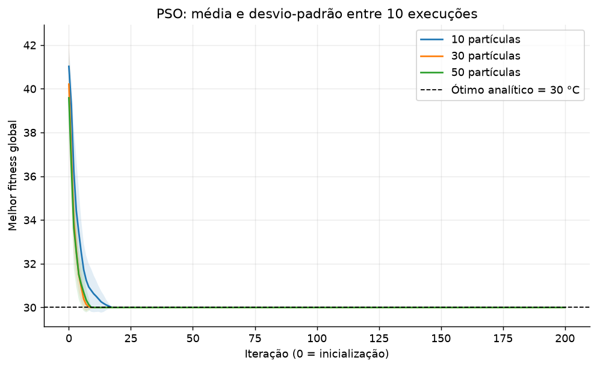
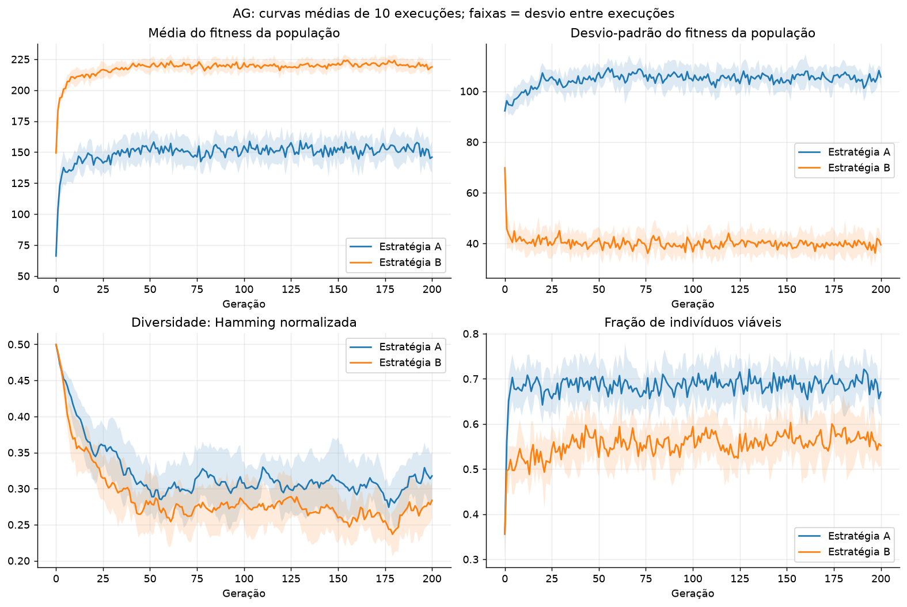
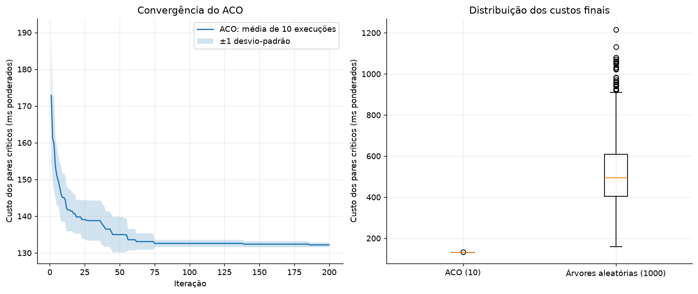
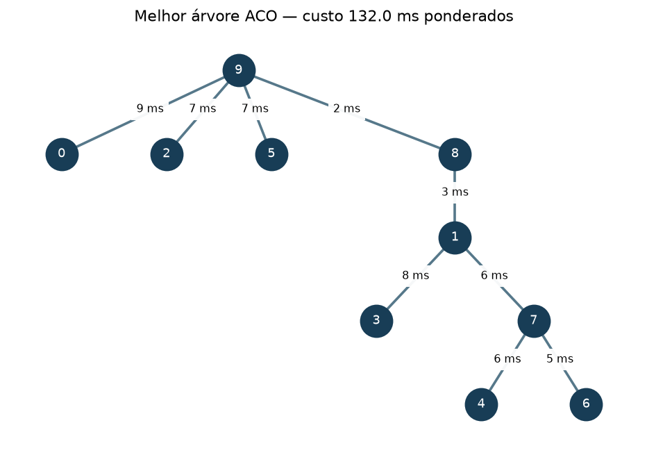

# Resultados da Aula 08 — Fechamento da AC-2

## Escopo, reprodução e hipóteses

Foram implementados do zero e executados PSO contínuo, AG binário e ACO sobre arestas. NumPy foi usado para operações numéricas e sorteios, e Matplotlib para gráficos. Não foram usadas bibliotecas de otimização prontas.

**Os dados do AG e do ACO são sintéticos**, pois o enunciado não fornece a tabela dos serviços, a matriz D nem os pares críticos. Sua origem e as hipóteses estão em [dados/README.md](dados/README.md). Estes resultados demonstram a execução da atividade sob essas hipóteses e devem ser refeitos se o professor fornecer entradas ou interpretações diferentes.

Executar a partir da raiz do repositório, no PowerShell:

```powershell
python -m venv AULA_08/.venv
& AULA_08/.venv/Scripts/python.exe -m pip install -r AULA_08/requirements.txt
& AULA_08/.venv/Scripts/python.exe -m unittest discover -s AULA_08 -p 'test_*.py' -v
& AULA_08/.venv/Scripts/python.exe AULA_08/lab01_aula08.py
& AULA_08/.venv/Scripts/python.exe AULA_08/lab02_aula08.py
& AULA_08/.venv/Scripts/python.exe AULA_08/lab03_aula08.py
& AULA_08/.venv/Scripts/python.exe AULA_08/gerar_relatorio.py
```

Todos os caminhos de entrada e saída são relativos ao arquivo Python, permitindo executar também de outro diretório. Há dez sementes (0 a 9) por configuração, sem selecionar execuções para omitir resultados desfavoráveis. Tempos são medições de parede e variam conforme a máquina. Os gráficos de convergência apresentam médias e um desvio-padrão amostral entre execuções; as faixas não são intervalos de confiança.

Ambiente medido: Python 3.13.13, NumPy 2.5.1, Matplotlib 3.11.1. Detalhes em [ambiente.json](saidas/ambiente.json). A execução registrada usou o ambiente já existente `.venv` na raiz do repositório. Nesse ambiente, o comando único `& .venv/Scripts/python.exe AULA_08/executar_todos.py` executa todas as etapas e salva os logs. Os comandos acima permitem recriar um ambiente separado.

## Lab 01 — PSO

Código: [lab01_aula08.py](lab01_aula08.py). Objetivo minimizado: `W @ C + penalidade`, com `C = [42,35,58,30,50,65]`, pesos não negativos e soma 1. Hipótese: temperaturas individuais constantes `T_i=C_i`; penalidade externa `10*sum(max(T_i-75,0)^2)`. Com os dados oficiais, a penalidade é sempre zero. Um teste separado verifica temperaturas acima do limite.

Parâmetros: 200 iterações, inércia 0.7, coeficientes cognitivo/social 1.5, posições iniciais uniformes positivas normalizadas e velocidades em [-0.1,0.1]. Após atualizar posições, valores negativos são zerados e o vetor é normalizado; vetor nulo vira distribuição uniforme. `pbest` e `gbest` são atualizados e copiados a cada iteração; seus vetores estão nos arquivos compactados `saidas/pso_memoria_*.npz`.

### Melhor distribuição por população

Empates são representados pela primeira semente encontrada. Temperatura é o valor sem penalidade.

| Partículas | Semente | W (AZ1 a AZ6) | Soma | Temperatura (°C) | Penalidade |
| --- | --- | --- | --- | --- | --- |
| 10 | 0 | 0.000000, 0.000000, 0.000000, 1.000000, 0.000000, 0.000000 | 1.0000000000 | 30.000000 | 0.0 |
| 30 | 0 | 0.000000, 0.000000, 0.000000, 1.000000, 0.000000, 0.000000 | 1.0000000000 | 30.000000 | 0.0 |
| 50 | 0 | 0.000000, 0.000000, 0.000000, 1.000000, 0.000000, 0.000000 | 1.0000000000 | 30.000000 | 0.0 |

### Comparação das dez execuções

| Partículas | Fitness final: média ± DP | Atingiu 30 ± 1e-6 | Iteração média até ótimo¹ | Avaliações² | Tempo médio (s) |
| --- | --- | --- | --- | --- | --- |
| 10 | 30.0000 ± 0.0000 | 10/10 | 11.4 | 2010 | 0.0182 |
| 30 | 30.0000 ± 0.0000 | 10/10 | 6.5 | 6030 | 0.0165 |
| 50 | 30.0000 ± 0.0000 | 10/10 | 6.7 | 10050 | 0.0173 |

Nesta execução, a população de **30 partículas** atingiu a tolerância em menos iterações, na média. As três configurações chegaram ao mesmo fitness final em todas as sementes. Logo, não houve ganho de qualidade final com populações maiores; os tempos muito curtos estão sujeitos a variações de medição.

¹ Apenas execuções que atingiram a tolerância; 0 indica inicialização. ² Avaliações de posições candidatas: N×201; recálculos do melhor global para registro não estão incluídos.



O mínimo analítico é 30 °C: uma combinação convexa dos coeficientes não pode ser menor que seu menor componente. O vetor que concentra o tráfego na AZ4 atinge esse limite. Portanto, a concentração observada decorre da formulação, que não impõe capacidade máxima por AZ nem carga mínima nas demais. O problema não modela efetivamente aquecimento dinâmico ou resiliência a falhas. População maior implica mais avaliações para as mesmas 200 iterações; convergência deve ser analisada junto desse custo.

Saídas completas: [resultados por execução](saidas/lab01_resultados.json) e [histórico por iteração](saidas/lab01_historico.csv).

## Lab 02 — AG binário

Código: [lab02_aula08.py](lab02_aula08.py). Cada indivíduo possui 15 bits, com limites simultâneos de 16 GB de RAM e 8 cores. Dados sintéticos:

| ID | Serviço | Valor | RAM (GB) | CPU (cores) |
| --- | --- | --- | --- | --- |
| 1 | autenticacao | 35 | 2 | 1 |
| 2 | gateway | 45 | 2 | 1.5 |
| 3 | cache | 28 | 4 | 0.5 |
| 4 | telemetria | 18 | 1 | 0.5 |
| 5 | antifraude | 55 | 3 | 2 |
| 6 | recomendacao | 48 | 4 | 2 |
| 7 | busca | 42 | 3 | 1.5 |
| 8 | notificacao | 20 | 1 | 0.5 |
| 9 | pagamentos | 60 | 3 | 2 |
| 10 | catalogo | 32 | 2 | 1 |
| 11 | compressao | 22 | 1 | 1.5 |
| 12 | analise_eventos | 38 | 4 | 1 |
| 13 | sessoes | 25 | 2 | 0.5 |
| 14 | auditoria | 16 | 1 | 0.5 |
| 15 | roteamento | 30 | 2 | 1 |

Parâmetros: população 100, 200 gerações, torneio de 3 sem reposição, crossover de ponto único com probabilidade 0.8, mutação independente por bit com probabilidade 1/15 e um elite por fitness. A e B começam com a mesma população para cada semente. Ambas arquivam separadamente a melhor solução viável. Não há reparação.

- A: `fitness=V` se viável; caso contrário, zero.
- B: `fitness=V-20*max(R-16,0)-40*max(CPU-8,0)`, inclusive valores negativos.

Os coeficientes de B foram fixados antes da execução. A distância de Hamming média normalizada entre pares distintos mede diversidade; média e desvio-padrão do fitness medem a distribuição de aptidão, não diversidade genética. O desvio dentro de cada população usa divisor N; os desvios entre execuções usam N−1.



Cada curva é a média da métrica em dez execuções. No painel de desvio do fitness, calcula-se primeiro o desvio entre indivíduos em cada geração, depois sua média entre execuções. A faixa mostra a dispersão dessa métrica entre execuções. As escalas de fitness A/B diferem; a qualidade final é comparada pelo valor de negócio viável.

| Estratégia | Melhor valor viável | Valor: média ± DP | Atingiu ótimo /10 | Diversidade média¹ | Diversidade final média |
| --- | --- | --- | --- | --- | --- |
| A | 265.0 | 265.00 ± 0.00 | 10 | 0.3204 | 0.3175 |
| B | 265.0 | 265.00 ± 0.00 | 10 | 0.2866 | 0.2838 |

¹ Média das gerações 0–200 e das dez execuções. Maior diversidade média observada: estratégia **A**. Essa comparação é descritiva e não prova superioridade estatística ou generalização. O ótimo exato desta instância é **265**, obtido pela enumeração das 32.768 combinações, usada apenas como referência.

### Melhor solução viável — A

Semente 0; bits na ordem dos IDs 1–15: `110100011100101`.

Serviços: autenticacao, gateway, telemetria, notificacao, pagamentos, catalogo, sessoes, roteamento.

Valor **265**, RAM **15/16 GB**, CPU **8/8 cores**, diferença para ótimo **0**.

### Melhor solução viável — B

Semente 0; bits na ordem dos IDs 1–15: `110100011100101`.

Serviços: autenticacao, gateway, telemetria, notificacao, pagamentos, catalogo, sessoes, roteamento.

Valor **265**, RAM **15/16 GB**, CPU **8/8 cores**, diferença para ótimo **0**.

As duas estratégias empataram no melhor valor viável observado.

Resultados completos: [execuções e ótimo exato](saidas/lab02_resultados.json), [métricas de cada geração](saidas/lab02_historico.csv).

## Lab 03 — ACO

Código: [lab03_aula08.py](lab03_aula08.py). Matriz física D sintética (ms), com linhas/colunas na ordem dos switches 0 a 9:

```text
  0  14  15  12  11  21   9  11  10   9
 14   0  18   8   7  13  10   6   3  27
 15  18   0  10  24   6  14  12  22   7
 12   8  10   0  15  27  20  18  10  15
 11   7  24  15   0   6  28   6   4  28
 21  13   6  27   6   0   7   5  25   7
  9  10  14  20  28   7   0   5  20  29
 11   6  12  18   6   5   5   0  28  17
 10   3  22  10   4  25  20  28   0   2
  9  27   7  15  28   7  29  17   2   0
```

Pares críticos sintéticos e pesos:

| Origem | Destino | Peso |
| --- | --- | --- |
| 0 | 5 | 3 |
| 1 | 8 | 2 |
| 2 | 9 | 3 |
| 3 | 7 | 2 |
| 4 | 6 | 1 |
| 0 | 9 | 2 |

Objetivo: `L(T)=sum(q_uv * distancia_na_arvore(u,v))`, em ms ponderados. Os pesos são adimensionais. Não se trata de minimizar apenas a soma das nove arestas.

Parâmetros: 30 formigas, 200 iterações, alpha=1, beta=2, tau inicial=1 nas arestas, rho=0.2 e Q=100. Cada formiga adiciona arestas entre componentes distintos com probabilidade proporcional a `tau/D²`. Union-Find evita ciclos; a construção termina com nove arestas e conectividade verificada.

**Interpretação adotada:** evaporação e depósito somente nas arestas da melhor árvore da iteração: `tau_ij=0.8*tau_ij+100/L(T)`. As demais arestas não mudam. Essa leitura literal do enunciado difere da evaporação global usual e não implica que o feromônio sempre aumente nas arestas escolhidas. A interpretação foi definida antes dos experimentos.

Para cada semente ACO, geraram-se 100 árvores de referência com uma sequência independente de sorteios (semente 1000+s). Cada etapa da referência sorteia uniformemente uma aresta elegível, sem usar latência ou feromônio. A distribuição resultante não é necessariamente uniforme sobre todas as árvores possíveis. A primeira árvore, sem seleção pelo custo, é a referência individual; as 100 permitem avaliar a dispersão.

Ganho: `100*(L_referencia-L_ACO)/L_referencia`. Valores positivos indicam redução. A mesma função de custo avalia ambos.

| Semente | Custo ACO | Referência individual | Ganho (%) | 100 referências: média ± DP | Ganho vs. média (%) |
| --- | --- | --- | --- | --- | --- |
| 0 | 132.0 | 352.0 | 62.50 | 506.26 ± 167.00 | 73.93 |
| 1 | 132.0 | 257.0 | 48.64 | 528.34 ± 146.61 | 75.02 |
| 2 | 132.0 | 671.0 | 80.33 | 524.11 ± 182.15 | 74.81 |
| 3 | 132.0 | 605.0 | 78.18 | 508.38 ± 165.83 | 74.04 |
| 4 | 132.0 | 419.0 | 68.50 | 540.87 ± 183.90 | 75.59 |
| 5 | 132.0 | 714.0 | 81.51 | 497.82 ± 147.59 | 73.48 |
| 6 | 134.0 | 414.0 | 67.63 | 519.72 ± 138.79 | 74.22 |
| 7 | 132.0 | 624.0 | 78.85 | 526.93 ± 151.59 | 74.95 |
| 8 | 132.0 | 468.0 | 71.79 | 508.67 ± 168.48 | 74.05 |
| 9 | 132.0 | 418.0 | 68.42 | 506.74 ± 158.22 | 73.95 |

Custo ACO final: média **132.20**, desvio-padrão **0.63**. Melhor execução: semente **0**, custo **132.0**.



### Matriz de adjacência da melhor árvore

```text
  0   0   0   0   0   0   0   0   0   1
  0   0   0   1   0   0   0   1   1   0
  0   0   0   0   0   0   0   0   0   1
  0   1   0   0   0   0   0   0   0   0
  0   0   0   0   0   0   0   1   0   0
  0   0   0   0   0   0   0   0   0   1
  0   0   0   0   0   0   0   1   0   0
  0   1   0   0   1   0   1   0   0   0
  0   1   0   0   0   0   0   0   0   1
  1   0   1   0   0   1   0   0   1   0
```

A matriz é binária, simétrica, com diagonal zero e 18 entradas iguais a 1, representando nove arestas não direcionadas.

| Switch u | Switch v | Latência (ms) |
| --- | --- | --- |
| 8 | 9 | 2 |
| 1 | 8 | 3 |
| 4 | 7 | 6 |
| 1 | 7 | 6 |
| 5 | 9 | 7 |
| 0 | 9 | 9 |
| 2 | 9 | 7 |
| 1 | 3 | 8 |
| 6 | 7 | 5 |

Decomposição do custo da melhor árvore:

| Par crítico | Distância na árvore (ms) | Peso | Contribuição |
| --- | --- | --- | --- |
| 0–5 | 16 | 3 | 48 |
| 1–8 | 3 | 2 | 6 |
| 2–9 | 7 | 3 | 21 |
| 3–7 | 14 | 2 | 28 |
| 4–6 | 11 | 1 | 11 |
| 0–9 | 9 | 2 | 18 |



A avaliação usa todos os caminhos críticos da árvore. A comparação com árvores aleatórias evidencia ganho nessa instância e nesse orçamento, mas não certifica ótimo global nem superioridade sobre outros algoritmos. O algoritmo recebe mais avaliações que a referência individual; o ganho não é uma comparação de eficiência sob orçamento igual.

Saídas completas: [resultados e árvores de referência individuais](saidas/lab03_resultados.json), [histórico](saidas/lab03_historico.csv), [1000 custos aleatórios](saidas/lab03_referencias.csv) e [adjacência CSV](saidas/lab03_adjacencia.csv).

## Validação e conclusões

[test_aula08.py](test_aula08.py) verifica normalização de vetores nulos/negativos, penalidade térmica acima de 75 °C, memórias do PSO, capacidades exatas e violações isoladas de RAM/CPU, diversidade, ótimo do AG por uma segunda enumeração, custo de caminhos em uma árvore conhecida, rejeição de ciclos e grafos desconectados, atualização seletiva de feromônio e validade de árvores. Os próprios experimentos também verificam restrições e monotonicidade dos melhores resultados.

- PSO: o objetivo linear e as temperaturas constantes limitam a interpretação operacional; concentrar carga no menor coeficiente é coerente com o modelo.
- AG: a diversidade foi medida diretamente e a qualidade viável comparada com ótimo exato. Mudanças de dados e coeficientes de penalidade podem alterar a conclusão.
- ACO: as árvores são válidas e o custo considera caminhos críticos. A referência aleatória tem definição explícita e não há certificado de ótimo global.

Não foram encontradas instruções específicas para agentes de IA nos materiais textuais verificados durante o planejamento. Os requisitos acadêmicos foram usados como base da implementação.

Validação executada: **10 testes aprovados**; [log dos testes](saidas/testes.log). Registros de execução: [PSO](saidas/lab01_aula08.log), [AG](saidas/lab02_aula08.log), [ACO](saidas/lab03_aula08.log). Os quatro gráficos foram inspecionados visualmente.
