# Resultados da AULA 09 — AC-3, parte 1

Entrega executada em 07/10/2026. Os valores abaixo foram obtidos pela execução dos três laboratórios. Este relatório reúne as justificativas dos universos e funções de pertinência, as regras, os resultados e os gráficos solicitados.

## Execução e fontes

Fontes da atividade: `LOGICA FUZZY - 07102026.docx`, os Labs 01 e 02 fornecidos e [enunciado do Lab 03](lab03_aula09.txt), preservado como texto. A implementação autoral está em [lab03_aula09.py](lab03_aula09.py). Os parâmetros dos scripts prevalecem sobre o exemplo ilustrativo do DOCX: a gorjeta em (7,3) não precisa ser 20,2%.

Ambiente validado: python 3.13.13; numpy 2.5.1; matplotlib 3.11.1; scikit-fuzzy 0.5.0; scipy 1.18.1; networkx 3.7. `uv sync` concluiu sem erro; os cinco pacotes de modelagem e suporte foram importados durante a execução.

Na raiz do repositório:

```powershell
uv sync
uv run python AULA_09/lab01_aula09.py --sem-janela
uv run python AULA_09/lab02_aula09.py --sem-janela
uv run python AULA_09/lab03_aula09.py --sem-janela
```

`--sem-janela` salva todas as imagens e fecha as figuras, sem pedir notas. Sem essa opção, os gráficos são salvos antes da exibição; no Lab 02, Enter aceita serviço 7 e comida 3. Entradas opcionais: `--servico 7 --comida 3` no Lab 02; `--cpu 10 --latencia 30` no Lab 03. NaN, infinitos e entradas fora do domínio são rejeitados com mensagem que identifica a variável e o intervalo, sem recorte silencioso. Os arquivos são resolvidos pela localização dos scripts. Os três scripts são independentes e imprimem seus resultados no terminal; atualize as tabelas deste relatório após alterar os modelos.

## Lab 01 — ventilador

Temperatura: 0–40 °C, passo 1; frio trap [0,0,15,25], morno tri [15,25,35], quente trap [25,35,40,40]. Velocidade: 0–100%, passo 1; baixa tri [0,0,50], média tri [0,50,100], alta tri [50,100,100]. Regras: frio → baixa, morno → média, quente → alta; Mamdani com centroide.

A faixa de temperatura é didática. Os platôs representam estabilidade nas regiões claramente frias e quentes; o pico de morno representa 25 °C, com transições entre regiões. A saída é porcentagem de comando e não RPM. Triângulos de saída permitem combinações graduais e preservam o modelo fornecido.

| Temperatura (°C) | Pertinências frio / morno / quente | Comando (%) | Impressão original (%) |
| --- | --- | --- | --- |
| 10 | 1,000000 / 0,000000 / 0,000000 | 16,666667 | 17 |
| 20 | 0,500000 / 0,500000 / 0,000000 | 44,047619 | 44 |
| 25 | 0,000000 / 1,000000 / 0,000000 | 50,000000 | 50 |
| 30 | 0,000000 / 0,500000 / 0,500000 | 55,952381 | 56 |
| 38 | 0,000000 / 0,000000 / 1,000000 | 83,333333 | 83 |
| 0 | 1,000000 / 0,000000 / 0,000000 | 16,666667 | 17 |
| 40 | 0,000000 / 0,000000 / 1,000000 | 83,333333 | 83 |

A lógica fuzzy permite que uma temperatura pertença parcialmente a categorias vizinhas. A 20 °C, frio e morno têm pertinência 0,5: ambas as regras cortam seus consequentes em 0,5. O máximo dessas áreas forma a saída agregada e o centroide fornece 44,047619%. A 30 °C ocorre a mistura simétrica de morno e quente. Nos extremos, o centroide de baixa é 16,666667% e o de alta é 83,333333%, mesmo com ativação plena. Portanto, 0 °C não significa desligado, e 40 °C não significa comando máximo; essa é uma limitação dos conjuntos do exemplo, a remodelar caso o controlador real exija esses comportamentos.

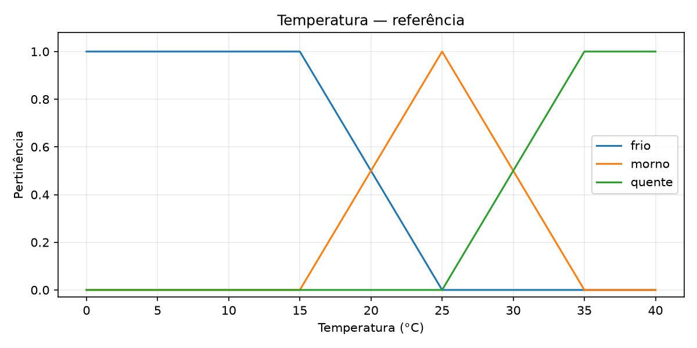

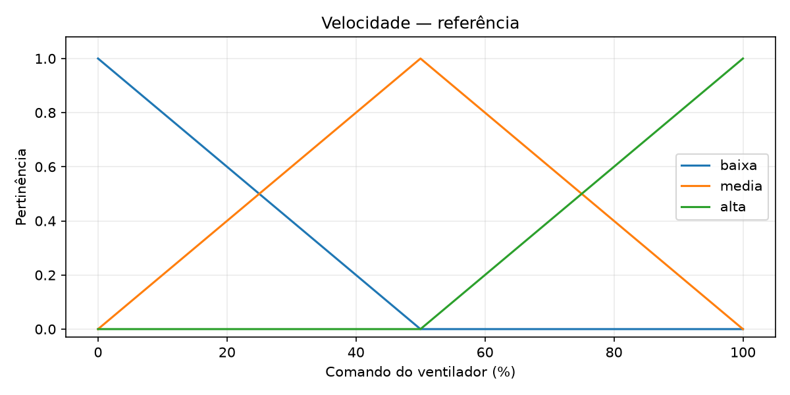

## Lab 02 — gorjeta

Serviço e comida usam notas 0–10, passo 0,1, com ruim tri [0,0,5], médio tri [0,5,10] e bom tri [5,10,10]. Gorjeta usa 0–25% da conta, passo 0,5: baixa [0,0,13], média [0,13,25] e alta [13,25,25], todas triangulares. O pico da média permanece **13**, como no arquivo. A escala inclui a pior avaliação em 0, e 25% é um teto didático; triângulos oferecem uma modelagem simples e sobreposta.

Regras de referência: R1 serviço ruim OU comida ruim → baixa; R2 serviço médio → média; R3 serviço bom OU comida boa → alta. `comida['bom']` corresponde ao termo “excelente” da solicitação, sem criar um quarto conjunto de comida.

### Referência e experimento 1 — regra 2 com E

| Modelo em (7,3) | R1 | R2 | R3 | Gorjeta (%) |
| --- | --- | --- | --- | --- |
| Referência | 0,400000 | 0,600000 | 0,400000 | 12,549519 |
| Regra 2 E | 0,400000 | 0,600000 | 0,400000 | 12,549519 |
| Serviço trapezoidal | 0,400000 | 0,500000 | 0,666667 | 13,588817 |

Em (7,3), serviço tem pertinências ruim=0, médio=0,6 e bom=0,4; comida tem ruim=0,4, médio=0,6 e bom=0. OU usa máximo, logo R1 e R3 ativam em 0,4. Na referência, R2 ativa em 0,6. Com E, mínimo(0,6;0,6)=0,6: a área agregada e a saída continuam idênticas, **12,549519%**, ou 12,5% na impressão de uma casa decimal. A igualdade é específica desse caso; se a pertinência de comida média for menor que a de serviço médio, a nova R2 terá ativação menor.

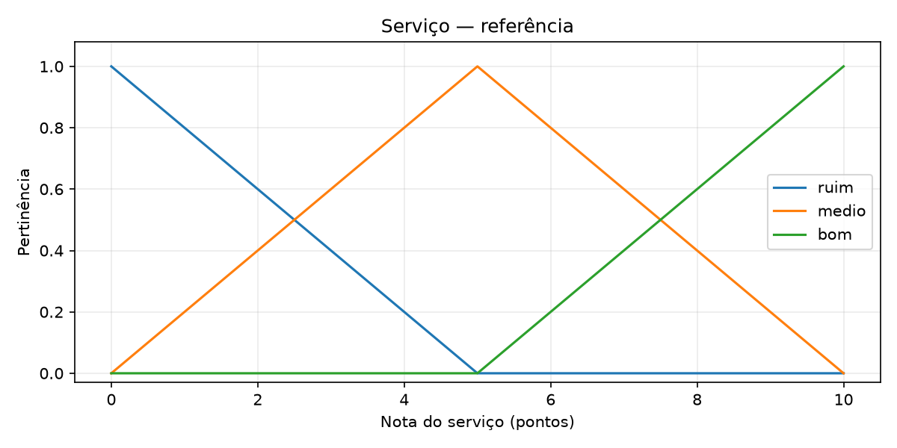

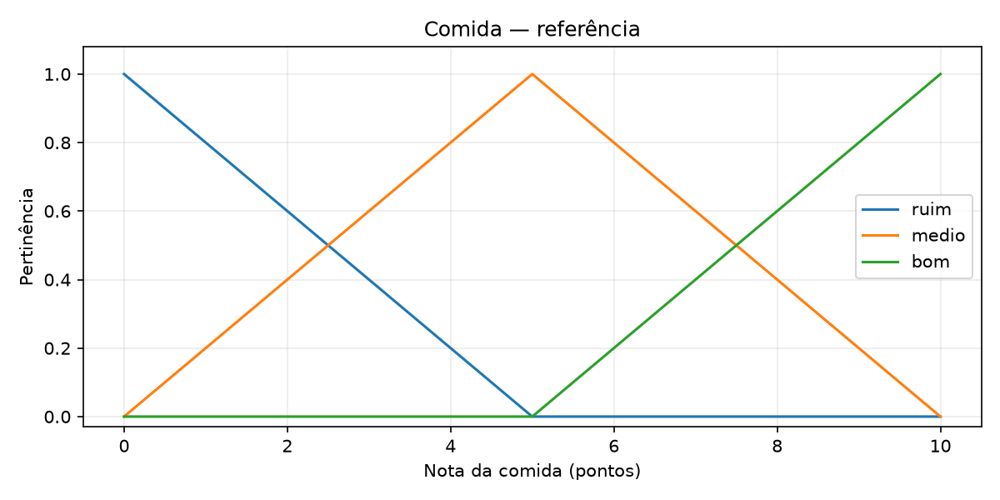

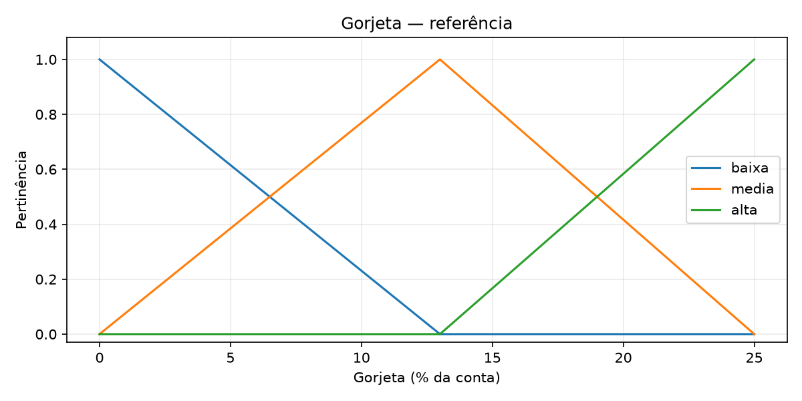

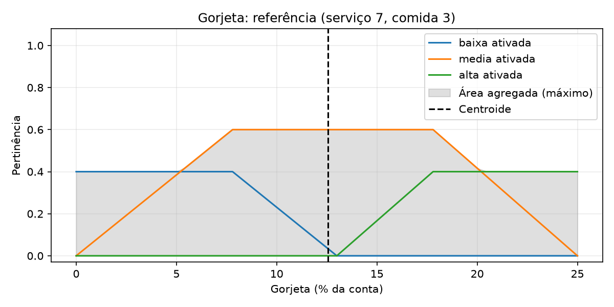

### Experimento 2 — serviço trapezoidal

Apenas serviço muda: ruim trap [0,0,2,5], médio trap [2,4,6,8], bom trap [5,8,10,10]. Comida, gorjeta, regras e centroide preservam a referência. Os platôs representam faixas de avaliação estáveis; sobreposições evitam lacunas. Em (7,3), serviço médio=0,5 e bom=0,666667, gerando **13,588817%**, diferença de 1,039298 ponto percentual.

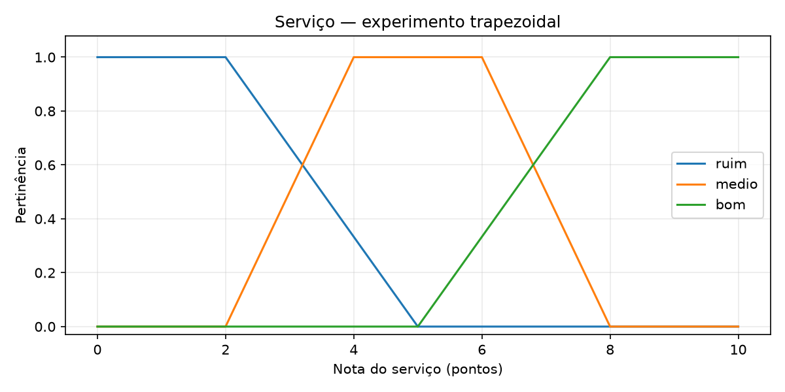

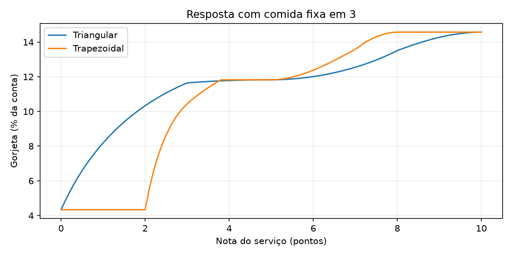

Com comida fixa em 3, foram avaliadas 101 notas de serviço entre 0 e 10, espaçadas em 0,1. A primeira medida abaixo é o maior salto entre amostras consecutivas; a segunda é o maior módulo da diferença entre dois incrementos consecutivos. Unidades: pontos percentuais de gorjeta.

| Família | Maior variação por 0,1 ponto de serviço (p.p.) | Maior segunda diferença (p.p.) |
| --- | --- | --- |
| Triangular | 0,522868 | 0,084088 |
| Trapezoidal | 1,222740 | 1,222740 |

Os trapézios escolhidos apresentam platôs, mas maior variação máxima e maior segunda diferença, especialmente quando o conjunto médio começa a ativar após serviço 2. Assim, nesta amostragem, não há evidência de melhora de suavidade. Essas medidas descrevem a curva avaliada; não demonstram suavidade global nem acurácia.

### Experimento 3 — defuzzificação

As entradas, conjuntos e ativações são os mesmos da referência (7,3); só o método muda.

| Método | Gorjeta em (7,3) (%) |
| --- | --- |
| centroid | 12,549519 |
| bisector | 12,583494 |
| mom | 12,754545 |

`centroid` considera toda a área e calcula seu centro de massa. `bisector` encontra a abscissa que divide a área em duas metades iguais. `mom` calcula a média das posições amostradas/refinadas que atingem o máximo de pertinência, conforme o universo usado pela biblioteca; não usa toda a área como o centroide. A forma agregada é quase equilibrada, mas assimétrica pelo pico 13, por isso os resultados são próximos e diferentes. MOM não garante continuidade em todas as transições.

### Experimento 4 — serviço excelente

Acrescentou-se excelente trap [8,9,10,10] ao serviço e R4: serviço excelente → gorjeta alta, mantendo todos os conjuntos e regras de referência. O suporte positivo começa acima de 8 e a pertinência é plena desde 9, sobrepondo bom para destacar avaliações muito altas.

| Serviço | Comida | Referência (%) | Com excelente (%) | Diferença (p.p.) |
| --- | --- | --- | --- | --- |
| 8.0 | 3.0 | 13,514521 | 13,514521 | 0,000000 |
| 9.0 | 3.0 | 14,274177 | 14,497581 | 0,223404 |
| 10.0 | 3.0 | 14,575066 | 14,575066 | 0,000000 |
| 9.0 | 10.0 | 17,014430 | 17,014430 | 0,000000 |

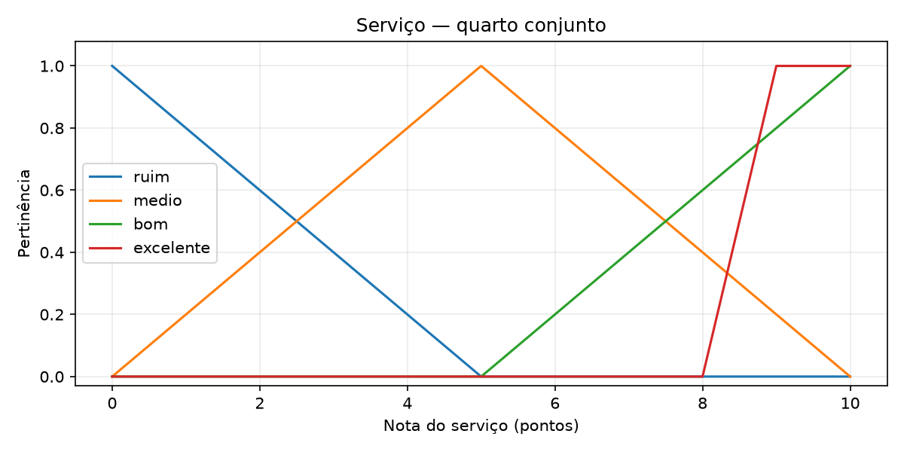

Em (9,3), a nova regra eleva a ativação de alta de 0,8 para 1, aumentando a sugestão. Em (8,3), excelente ainda vale 0; em (10,3), bom já vale 1; em (9,10), comida boa já ativa alta em 1. Nesses casos, não há alteração: a agregação usa máximo, sem somar regras repetidas. Comida ruim em 3 continua ativando baixa em 0,4, o que limita a sugestão mesmo com serviço excelente.

### Experimento 5 — extremos e centro

| Serviço | Comida | Expectativa qualitativa | Gorjeta observada (%) |
| --- | --- | --- | --- |
| 0.0 | 0.0 | baixa | 4,333333 |
| 10.0 | 10.0 | alta | 21,000000 |
| 5.0 | 5.0 | média | 12,666667 |

Em (0,0), apenas baixa ativa em 1, e seu centroide triangular é (0+0+13)/3=4,333333%. Em (10,10), apenas alta ativa em 1, produzindo (13+25+25)/3=21%. Em (5,5), apenas média ativa plenamente; seu centroide é (0+13+25)/3=12,666667%, diferente do pico 13 porque o triângulo é assimétrico. As respostas são coerentes com as expectativas qualitativas; os extremos não exigem 0% ou 25%.

## Lab 03 — prioridade de intervenção em servidor

### Definição do problema (cinco linhas)

Um servidor pode apresentar carga alta e/ou lentidão, exigindo investigação gradual.  
Hoje um operador de infraestrutura decide quando investigar a partir das métricas.  
Entradas: uso de CPU (0–100%) e latência (0–500 ms) da operação monitorada.  
Saída: prioridade de intervenção (0–100 pontos), uma sugestão ao operador.  
Fuzzy combina carga e lentidão com sobreposições e dez regras, sem um único limiar.

### Universos, pertinências e regras

| Variável | Universo / passo | Baixa | Média | Alta |
| --- | --- | --- | --- | --- |
| CPU | 0–100% / 1 p.p. | trap [0,0,20,40] | tri [20,50,80] | trap [60,80,100,100] |
| Latência | 0–500 ms / 1 ms | trap [0,0,100,200] | tri [100,250,400] | trap [300,400,500,500] |
| Prioridade | 0–100 pontos / 1 ponto | trap [0,0,20,40] | tri [20,50,80] | trap [60,80,100,100] |

CPU é porcentagem de uso da capacidade medida. O limite 500 ms é hipótese didática, não um SLA real; valores maiores requerem remodelagem. Prioridade é um índice relativo, não probabilidade nem prazo. Os trapézios estabilizam as regiões baixa (até 20% ou 100 ms) e alta (desde 80% ou 400 ms); os triângulos médios têm pico em 50% e 250 ms. As sobreposições permitem decisões graduais. Os parâmetros carecem de calibração para produção.

Cada célula da matriz é uma regra E: CPU do termo da linha E latência do termo da coluna → prioridade da célula, totalizando nove regras.

| CPU / Latência | Baixa | Média | Alta |
| --- | --- | --- | --- |
| Baixa | Baixa | Média | Alta |
| Média | Média | Média | Alta |
| Alta | Alta | Alta | Alta |

R10: CPU alta OU latência alta → prioridade alta. Há dez regras no total, usando E e OU. O motor usa Mamdani, mínimo para E e corte, máximo para OU e agregação, e centroide.

R10 é parcialmente redundante: pode repetir a altura já atingida nas regras E, mas reforça alta nas sobreposições. Na malha 21×21, a maior diferença entre as bases com e sem R10 ocorreu em CPU 30% e latência 375 ms: 71,427184 → 74,715826 pontos, diferença de 3,288642. A regra expressa a política de investigar quando qualquer métrica está alta.

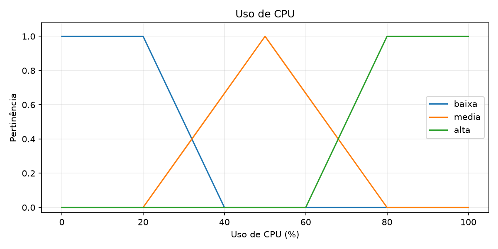

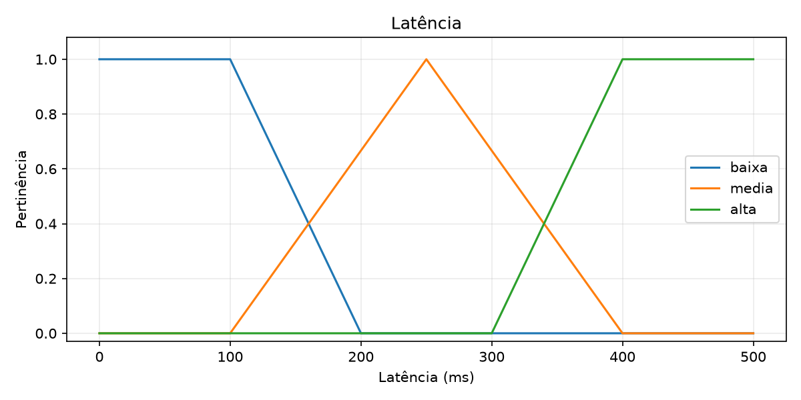

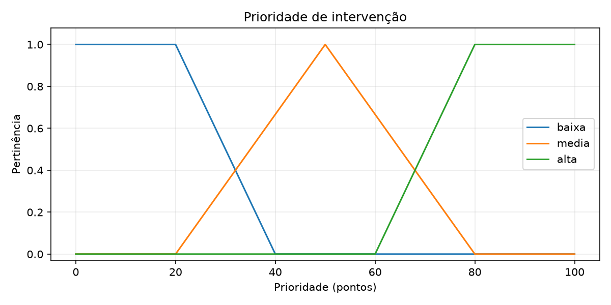

### Cenários executados

As expectativas estão declaradas em `CENARIOS` no código e derivam da matriz antes da execução. Os primeiros quatro casos atendem ao enunciado; os demais verificam extremos e transições.

| CPU (%) | Latência (ms) | Resposta esperada antes da execução | Prioridade observada (pontos) | Interpretação |
| --- | --- | --- | --- | --- |
| 10 | 30 | baixa | 15,555556 | baixa, condizente |
| 50 | 250 | média | 50,000000 | média, condizente |
| 90 | 450 | alta | 84,444444 | alta, condizente |
| 10 | 450 | alta | 84,444444 | alta pela latência, condizente |
| 0 | 0 | baixa | 15,555556 | extremo baixo, condizente |
| 100 | 500 | alta | 84,444444 | extremo alto, condizente |
| 30 | 150 | transição baixa/média | 33,771602 | mistura baixa/média |
| 70 | 350 | transição média/alta | 66,228398 | mistura média/alta |

O caso (10,450) recebe alta mesmo com CPU baixa: latência alta é suficiente pelas regras R3 e R10. As prioridades extremas ficam em 15,555556 e 84,444444 pontos, pois os centroides dos trapézios não coincidem com 0 e 100. Nas transições, a saída mistura áreas vizinhas, como pretendido. Os seis casos de expectativa simples também tiveram o termo esperado como maior pertinência na saída calculada; isso verifica coerência do modelo, sem medir acurácia real.

## Validação e limites

A verificação numérica realizada na entrega passou com **3248 simulações de malha** e **90 rejeições de entradas inválidas**. O total da malha não inclui as comparações adicionais de transições, oráculos e R10.

| Modelo | Simulações | Mínimo observado | Máximo observado | Inválidas rejeitadas |
| --- | --- | --- | --- | --- |
| lab01 | 161 | 16,666667 | 83,333333 | 6 |
| lab02_referencia | 441 | 4,333333 | 21,000000 | 12 |
| lab02_regra2_e | 441 | 4,333333 | 21,000000 | 12 |
| lab02_trapezoidal | 441 | 4,333333 | 21,000000 | 12 |
| lab02_bisector | 441 | 3,807612 | 21,485281 | 12 |
| lab02_mom | 441 | 0,000000 | 25,000000 | 12 |
| lab02_excelente | 441 | 4,333333 | 21,000000 | 12 |
| lab03 | 441 | 15,555556 | 84,444444 | 12 |

Todas as pertinências nativas e interpoladas nos meios dos intervalos são finitas em [0,1], com cobertura positiva. Lab 01 foi simulado a cada 0,25 °C; modelos de gorjeta em malha de notas a cada 0,5; servidor em CPU a cada 5% e latência a cada 25 ms. Todas as saídas dessas simulações foram finitas e dentro dos universos. A cobertura das funções lineares entre os nós, junto das bases completas de regras, evita regiões sem ativação; a malha é uma verificação numérica, não uma enumeração de todas as entradas reais.

Foram rejeitados NaN, +infinito, −infinito, texto inválido e valores 0,01 abaixo/acima do domínio, para cada entrada de cada modelo. Seis resultados de borda/centro dos Labs 01 e 02 foram conferidos contra centroides analíticos (tolerância absoluta 1e−9, rtol=0). Nos vértices internos de CPU e latência, 50 comparações em torno de ±0,0001 tiveram maior diferença de 0,000217 ponto, abaixo de 0,01, conferindo transições locais do Lab 03. Essa tolerância é de verificação numérica; não é tolerância de acurácia.

As 12 figuras têm legendas e unidades e foram salvas antes de qualquer exibição. Os links locais do relatório foram conferidos após a remoção dos arquivos auxiliares. Não foi calculada acurácia: faltam referência rotulada, métrica e tolerância de aplicação. Superfície 3D, dados reais e fechamento com tag pertencem aos próximos sprints.

A entrega ficou no diretório AULA_09. Não foram criados branch, commit ou tag; não houve push nem envio de e-mail.
